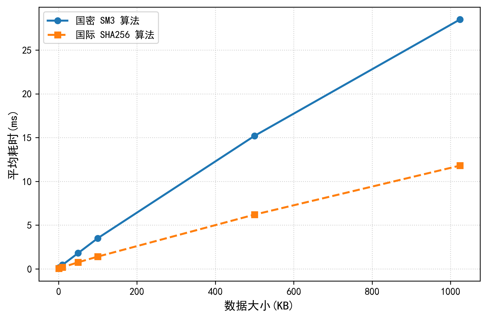
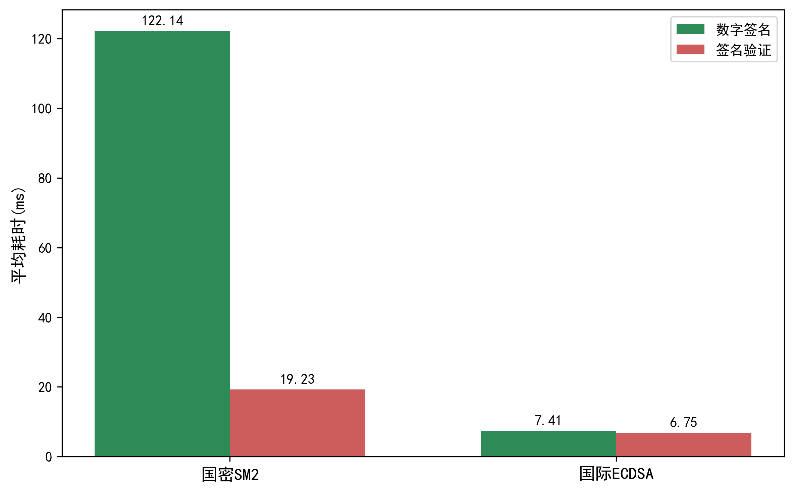

**分类号：**          **单位代码：** 10757
**密级：** 公开      **学号：** 10757232282

 

# TARIM UNIVERSITY

## 硕 士 学 位 论 文

# 基于区块链的农产品溯源关键技术研究
### Blockchain-based Key Technology Research on Agricultural Product Traceability

**研 究 生 姓名：** 柏小康
**指 导 教 师：** 张楠楠 教授
**合 作 指 导 教师：**
**申请学位门类级别：** 农学硕士
**专 业 名 称：** 农业工程与信息技术
**研 究 方 向：** 农业信息化
**所 在 学 院：** 信息工程学院

 

**新疆·阿拉尔**
**二〇二六年六月**

---

 

### Blockchain-based Key Technology Research on Agricultural Product Traceability

**A Dissertation Submitted to**
**Tarim University**
**In Partial Fulfillment of the Requirements for the Degree of**
**Master of Agriculture By**

**Bai Xiaokang**
(Agricultural Engineering and Information Technology)

**Dissertation Supervisor: Prof. Zhang Nannan**

**June, 2026**

---

 

**塔里木大学研究生学位论文**

**送 审 编 号：** TD
**学位授予类别：** 专业学位硕士
**论 文 题 目：** 基于区块链技术的农产品溯源关键技术研究
**一级学科名称：** 农业
**一级学科代码：** 0951
**二级学科名称：** 农业工程与信息技术
**二级学科代码：** 095136
**论文研究方向：** 农业信息化

---

# 基于区块链技术的农产品溯源关键技术研究

## 摘 要

近年来，农产品安全问题频发，严重影响了消费者信心与产业健康发展。传统农产品溯源系统多基于中心化数据库，存在数据不透明、易被篡改等弊端。区块链技术为构建可信溯源体系提供了全新方向，但在实际应用中仍面临存储容量受限以及国家商用密码体系合规等关键技术挑战。本文旨在研究并解决基于区块链的农产品溯源核心技术问题，提出一种安全、高效、合规的溯源整体解决方案。

针对农产品供应链特点，本文构建了基于Hyperledger Fabric联盟链的农产品溯源方案与覆盖“从农场到餐桌”全流程的信息交互模型，界定了各参与方节点的数据权责与协同验证机制。针对区块链海量数据存储的性能瓶颈，设计了区块链与IPFS协同的双存储数据管理模式。实施链上锚定核心哈希与数据索引、链下分布式托管原始大文件的分类治理策略，在保障数据不可篡改性的同时显著提升了存储与检索效率。此外，为满足国内农产品数据的信息安全与合规监管需求，本文对底层密码服务提供者模块进行了扩展与重构。独立完成了国密SM2、SM3及SM4算法的底层适配与深度集成，打通了国密数字证书与交易背书全流程，并通过实验验证了相关密码学操作的正确性与性能表现。最后，以阿克苏苹果真实供应链为对象开展实证分析。通过实地考察采集真实的产业链数据集，明确了多端用户的特征字段及关键节点的业务流转文本，在国密区块链平台上进行了深度验证。实验成功实现了多源多维度数据的可信录入、全链路溯源校验与穿透式监管，验证了该方案在复杂业务场景下的整体可行性与技术优越性。

研究结果表明，本文提出的关键技术解决方案能够有效提升农产品溯源系统的安全性、可信度和运行效率，为解决农产品安全问题、增强消费者信任、推动农业现代化提供了有价值的技术支撑和实践参考。

**关键词：** 区块链；农产品溯源；Hyperledger Fabric；IPFS；国密算法

---

## Abstract

In recent years, the frequent occurrence of agricultural product safety issues has severely affected consumer confidence and the healthy development of the industry. Traditional agricultural product traceability systems mostly rely on centralized databases, which suffer from data opacity and susceptibility to tampering. Blockchain technology provides a new direction for building trustworthy traceability systems. However, practical applications still face key technical challenges such as limited storage capacity and national commercial cryptography compliance. This paper aims to research and resolve the core technical issues of blockchain-based agricultural product traceability, proposing a secure, efficient, and compliant overall traceability solution.

According to the characteristics of the agricultural supply chain, this paper constructs an agricultural product traceability scheme based on the Hyperledger Fabric consortium blockchain and an information interaction model covering the entire process from farm to table, clearly defining the data responsibilities and collaborative verification mechanisms of participating nodes. To address the performance bottleneck of massive data storage on the blockchain, a dual-storage data management mode synergizing blockchain and the InterPlanetary File System (IPFS) is designed. A classified governance strategy is implemented, anchoring core hashes and data indexes on-chain while hosting original large files off-chain in a distributed manner, which significantly improves storage and retrieval efficiency while ensuring data immutability. Furthermore, to meet the information security and compliance regulatory requirements of domestic agricultural data, this paper expands and reconstructs the underlying cryptographic service provider module. The underlying adaptation and deep integration of the national cryptographic algorithms SM2, SM3, and SM4 are independently completed. The entire process of national cryptographic digital certificates and transaction endorsement is unblocked, and the correctness and performance of cryptographic operations are verified through experiments. Finally, an empirical analysis is conducted taking the real supply chain of Aksu apples as the object. By collecting real industrial chain datasets through field investigations, the feature fields of multi-terminal users and the business flow texts of key nodes are clarified, and deep verification is performed on the national cryptographic blockchain platform. The experiment successfully achieves the credible entry of multi-source and multi-dimensional data, full-link traceability verification, and penetrative supervision, verifying the overall feasibility and technical superiority of the scheme in complex business scenarios.

Research results show that the key technical framework proposed in this paper can effectively enhance the security, credibility, and network operational efficiency of agricultural product traceability data, providing valuable technical support for solving the lack of trust in complex supply chains and promoting the high-quality development of agricultural informatization.

**Key words:** Blockchain; Agricultural Product Traceability; Hyperledger Fabric; IPFS; National Cryptography Algorithm

---

## 目 录

*   [第1章 绪论](#第1章-绪论)
    *   [1.1 研究背景与意义](#11-研究背景与意义)
    *   [1.2 国内外研究现状](#12-国内外研究现状)
    *   [1.3 研究内容与技术路线](#13-研究内容与技术路线)
    *   [1.4 论文结构](#14-论文结构)
*   [第2章 区块链相关理论与技术基础](#第2章-区块链相关理论与技术基础)
    *   [2.1 区块链基础理论](#21-区块链基础理论)
    *   [2.2 Hyperledger Fabric 平台](#22-hyperledger-fabric-平台)
    *   [2.3 关键支撑技术](#23-关键支撑技术)
    *   [2.4 应用层开发技术栈](#24-应用层开发技术栈)
    *   [2.5 密码学基础](#25-密码学基础)
*   [第3章 基于区块链的农产品溯源方案与系统设计](#第3章-基于区块链的农产品溯源方案与系统设计)
    *   [3.1 溯源需求与流程分析](#31-溯源需求与流程分析)
    *   [3.2 区块链子系统设计](#32-区块链子系统设计)
    *   [3.3 系统总体架构设计](#33-系统总体架构设计)
    *   [3.4 应用服务层设计](#34-应用服务层设计)
    *   [3.5 用户界面层设计](#35-用户界面层设计)
*   [第4章 Hyperledger Fabric 平台国密算法嵌入研究与实现](#第4章-hyperledger-fabric-平台国密算法嵌入研究与实现)
    *   [4.1 Fabric 平台密码服务体系分析](#41-fabric-平台密码服务体系分析)
    *   [4.2 国密算法嵌入设计思路](#42-国密算法嵌入设计思路)
    *   [4.3 国密算法嵌入实现过程](#43-国密算法嵌入实现过程)
    *   [4.4 国密算法嵌入验证与分析](#44-国密算法嵌入验证与分析)
*   [第5章 农产品溯源系统实现与测试](#第5章-农产品溯源系统实现与测试)
    *   [5.1 系统环境搭建](#51-系统环境搭建)
    *   [5.2 核心功能模块实现](#52-核心功能模块实现)
    *   [5.3 系统功能测试](#53-系统功能测试)
    *   [5.4 系统性能评估](#54-系统性能评估)
*   [第6章 结论与展望](#第6章-结论与展望)
    *   [6.1 研究结论总结](#61-研究结论总结)
    *   [6.2 研究不足与展望](#62-研究不足与展望)
*   [参考文献](#参考文献)
*   [致谢](#致谢)

---

# 第1章 绪论

## 1.1 研究背景与意义
随着经济社会的快速进步和居民生活品质的提升，公众对于食品安全的关切度也随之显著增加。农产品作为食品的重要组成部分，其质量和安全直接影响到消费者的健康和生命安全[1]。如图1-1所示，近年来我国苹果产量持续保持高位，巨大的市场体量背后是对产品质量安全与品牌信誉的更高要求。然而，食品安全事件的接连发生，如2019年染色土鸡蛋，2022年问题酸菜，2024年煤油车混拉食用油，2025年黄焖鸡事件等，削弱了大众对市场上食用农产品的信任度。因此，如何提高食用农产品的安全生产水平、加强质量管理、畅通社会监管途径，并最终实现农产品的可信追溯，已成为学术界和产业界共同关注的焦点议题[2]。传统的农产品溯源系统普遍依赖中心化数据进行信息存储与访问，这种模式虽然在一定程度上实现了信息化管理，但其固有的信息不透明、数据易被篡改以及信任机制缺失等问题，使其难以满足现代农业生产的高标准和消费者对食品安全信息的高要求[3]。

图1-1 2014年-2024年中国苹果产量及增速情况

农产品供应链天然具有多主体参与、链条长、数据分散的特点，其流转过程涵盖了源头种植户、加工企业、物流承运方、终端零售商以及政府监管机构等众多环节。在传统模式下，各主体间信息互不透明，形成了严重的信息孤岛现象，数据真实性高度依赖于上下游节点间的信任背书，极易出现数据造假与责任推诿等问题。区块链技术的引入恰好能对症下药：其一，分布式账本特性允许多个平权参与方共同维护一套统一、不可篡改的账本，打破了信息孤岛；其二，智能合约能够将溯源规则代码化、自动化执行，减少人为干预；其三，共识机制与密码学签名确保了每一笔上链数据都经过多方验证和确认，从技术上杜绝了数据被单方面篡改的可能。

区块链技术以其去中心化、数据不可篡改、过程公开透明等核心特性，为构建可靠的农产品追溯体系提供了全新的技术路径[4]。将区块链技术融入传统农产品溯源模型，能够充分发挥其在数据管理和信任构建方面的独特优势，有效解决溯源系统在数据真实性、可靠性和安全性方面的核心诉求。本研究的核心目标在于通过运用区块链技术，显著提升农产品溯源系统的可信度和运行效率，从而为保障食品安全、促进农业现代化进程提供坚实的技术支撑。这项研究的意义不仅体现在底层研发环节的创新，更在于其对增强消费者信心、推动农业产业数字化转型、提高农业生产效率与管理水平的积极作用，同时也能为其他相关领域的区块链应用探索提供有益的参考与借鉴。

## 1.2 国内外研究现状
传统农产品溯源技术的发展经历了从人工记录到数字化管理的演变，其主要手段是利用现代信息技术对农产品从种植到消费的全过程进行记录与追踪。我国自2011年颁布《食品工业“十二五”发展规划》以来，便持续强调食品信息追溯体系的建设工作。尽管如条形码、二维码及RFID等自动化识别技术已在溯源实践中得到应用，并在一定程度上提升了信息记录的效率，但传统的溯源系统多构建于中心化的平台之上[5]，这导致了数据易被篡改、信息透明度不足、系统间信息孤岛等固有缺陷，难以从根本上解决信任问题。

近年来，区块链技术凭借其独特优势，在农产品溯源领域的应用研究日益受到国内外学者的重视。相关研究普遍认为区块链是提升供应链可追溯性的有效途径。例如，文献[6]提出了一种结合区块链与边缘计算的有机食品供应信息管理框架，旨在提高信息的可信度与处理效率。文献[7]则设计了基于联盟链和智能合约的农产品追踪框架，并创新性地引入星际文件系统（InterPlanetary File System, IPFS）来存储溯源过程中的海量非结构化数据，以缓解区块链的存储压力。针对链上数据存储的局限性，文献[8]进一步研究了链上与链下双存储结构，以优化信息查询效率和数据管理能力。此外，考虑到国内特定应用场景的合规性需求，文献[9]探索了在Hyperledger Fabric平台上集成国密算法的方案，以增强区块链系统的安全性与自主可控性。

综观国内外研究现状，虽然基于区块链的农产品溯源技术已取得一定进展，展现出解决传统溯源弊病的巨大潜力，但在实际应用中仍面临诸多挑战，尤其是在数据存储容量、系统可扩展性以及特定安全规范等方面尚存不足。因此，本文立足于现有研究基础，针对这些关键技术问题进行深入探讨，旨在提出更为完善和高效的农产品溯源解决方案，以期进一步提升系统的整体性能与实用价值。

## 1.3 研究内容与技术路线
本文针对现有农产品溯源系统在可信度、效率及合规性方面的挑战，聚焦于研究基于区块链技术的农产品溯源关键技术。研究以Hyperledger Fabric联盟链框架为基础平台，创新性地结合IPFS进行分布式数据存储，并集成我国自主的国密密码算法，旨在设计并构建一个兼具安全性、高效性和可信性的农产品溯源平台。具体研究内容主要包括以下几个方面：首先，深入分析农产品供应链的运作特点，明确系统架构需求和技术框架选型，设计一套基于Hyperledger Fabric的农产品溯源方案与系统模型，并清晰定义各参与方在信息交互流程中的角色与职责。其次，为解决区块链直接存储高清图像与监控视频等海量非结构化溯源数据所带来的存储容量有限和成本高昂问题，研究并引入IPFS分布式存储技术，构建一种链上锚定数据哈希值与内容标识符（Content Identifier, CID）等关键摘要信息，而链下由IPFS分布式托管原始大文件的混合数据存储架构。再次，为满足国内特定场景下的信息安全与合规性要求，以开源国密算法库为基础，深入研究Hyperledger Fabric平台的密码服务机制，完成包括非对称加密与签名算法SM2、哈希运算算法SM3以及对称加密算法SM4在内的核心密码模块及其接口在Fabric平台中的嵌入与适配工作。最后，基于上述方案设计与关键技术研究成果，搭建一个完整支持国密算法的Hyperledger Fabric网络环境，并结合IPFS存储，开发一个实际可操作的农产品溯源系统原型，通过该原型验证所提出方案的整体有效性和实用性。

本研究的技术路线遵循理论分析、方案设计、技术攻关、系统实现与测试验证的逻辑顺序进行。该路线图清晰地展示了从研究背景与问题提出、相关技术理论学习，到系统方案设计、双存储架构结合与国密算法嵌入等关键技术的实现，最后进行系统开发与测试验证的完整流程。
本文的技术路线如下图1-2所示。

图1-2 技术路线图

## 1.4 论文结构
本文采用递进式研究框架，共设置六章内容系统化推进基于区块链的农产品溯源关键技术研究。第一章绪论部分构建研究的逻辑起点，通过剖析农产品安全现状与传统溯源系统的技术缺陷，论证区块链技术的应用价值，明确研究目标与创新方向。在综述国内外研究进展基础上，确立了涵盖可信溯源模型构建、底层国密算法适配以及系统效能验证的完整研究路径，为后续章节奠定方法论基础。

第二章聚焦区块链技术体系的理论支撑，深入解析Hyperledger Fabric联盟链架构的核心机制与技术特性。从分布式账本原理到智能合约执行逻辑，系统阐述区块链技术的可信保障机制，重点探讨IPFS分布式存储与BCCSP密码服务提供者的技术融合方案。通过对比分析关系型数据库与区块链的数据管理范式，建立链上存证与链下扩展相结合的混合存储模型，为后续系统设计提供理论依据。技术栈选择部分论证前后端分离全栈开发模式的技术优势，阐明国密算法在数字签名与数据加密中的合规性要求。

第三章至第五章构成方案设计与实现验证的核心研究单元。第三章提出基于多维度需求分析的溯源系统架构，设计涵盖种植、加工、储运与销售环节的全流程数据上链策略，构建区块链子系统与应用服务层的协同机制。第四章突破国密算法与Fabric平台的技术融合瓶颈，通过重构BCCSP密码服务接口实现SM系列算法的深度集成，完成从证书管理到节点通信的国密化改造。第五章涵盖农产品溯源系统的具体实现与测试，详细描述了系统开发环境的搭建过程以及信息录入、溯源查询与数据监管等核心功能模块的实现细节，并对系统进行了全面功能测试和初步性能评估。

第六章总结全文研究工作，归纳本研究在可信溯源架构构建、底层密码算法适配与混合存储体系优化等方面的理论贡献与实践成效。同时客观评估当前系统的局限性，并从隐私保护增强、跨链交互以及物联网前沿技术集成等方面对未来研究工作进行展望。各章节内容既保持独立的研究维度，又通过技术演进路线形成有机整体，确保理论研究、技术创新与实践验证的螺旋式推进。

---

# 第2章 区块链相关理论与技术基础

## 2.1 区块链基础理论
区块链技术，其概念最早由中本聪在其关于比特币的白皮书中提出[10]，本质上是一种分布式账本技术。它通过区块与链式结构按时间顺序组织数据，并利用哈希函数与数字签名等密码学方法来保证数据记录的不可伪造与不可篡改[11]。区块链的核心特征主要包括多中心化的治理体系、不可篡改的数据记录、基于权限控制的公开透明机制以及全流程的可追溯性[12]。这些特性使得区块链在构建信任体系方面具有天然优势。根据网络节点的准入控制机制和开放程度的不同，区块链通常可以分为公有链、私有链和联盟链三大类[13]。公有链对所有用户开放，任何人都可以参与；私有链则由单一组织控制，权限高度集中；联盟链则介于两者之间，由多个预先授权的组织共同参与管理和维护。区块链区块与链式结构原理图如图2-1所示。

图2-1 区块链区块与链式结构原理图

在农产品溯源这类涉及多个利益相关方且需要一定程度权限控制的场景中，联盟链展现出其独特的适用性。联盟链采用弱中心化或多中心化的治理模式，网络中的节点通常代表具体的实体机构，其加入需要经过严格的身份认证和授权。这种机制使得联盟链在权限管理和数据隐私保护方面相较于公有链更为可控和灵活。同时，联盟链通常采用实用拜占庭容错（Practical Byzantine Fault Tolerance, PBFT）或Raft等高效共识机制，而非公有链常用的工作量证明（Proof of Work, PoW）等计算密集型算法。因此，联盟链在交易处理速度和系统可扩展性方面表现更优，且整体运营成本相对较低。

农产品供应链涉及从源头种植、生产加工、物流运输到终端零售及政府监管等多个确定的参与方。参与主体之间既有合作需求，也需要保护各自的商业数据隐私。联盟链的许可准入机制、基于通道架构实现的数据隔离功能，以及相对较高的处理性能，能够很好地满足这种多方协作且兼顾隐私与效率的复杂业务需求，使其成为构建企业级农产品溯源平台的理想技术选型。为更直观地说明联盟链的适用性，下表2-1从多个维度对不同类型的区块链进行了对比。

**表2-1 农产品溯源场景下不同类型区块链对比**

| 维度           | 公有链             | 私有链                   | 联盟链                   |
| :------------- | :----------------- | :----------------------- | :----------------------- |
| 权限控制       | 完全开放且无需许可 | 单一组织控制且高度中心化 | 需许可准入且多中心化治理 |
| 系统吞吐量/TPS | 极低               | 极高                     | 较高                     |
| 交易成本       | 极高               | 低                       | 较低                     |
| 隐私保护       | 交易公开且匿名性弱 | 隐私性好但透明度低       | 具备灵活的数据隔离机制   |

通过上表对比可知，农产品溯源场景涉及多个确定的企业和监管机构，需要严格的身份准入和权限控制，公有链的绝对开放性显然不适用。同时，单一企业控制的私有链又无法从根本上解决多主体间的信任问题。因此，由多个预授权节点共同治理的联盟链成为最理想的选择。本研究最终选用Hyperledger Fabric作为底层网络框架，因其专为企业级应用设计，其通道机制能有效隔离不同业务数据，且具备高度可插拔的共识组件与区块链密码服务提供者（Blockchain Cryptographic Service Provider, BCCSP），这为系统性能优化和后续国密算法的深度集成提供了优异的底层基础。

## 2.2 Hyperledger Fabric 平台
Hyperledger Fabric是由Linux基金会托管的一个开源分布式账本平台项目，专为企业级应用而设计，是联盟链领域最具代表性的技术框架之一。Fabric的核心优势在于其高度模块化和可插拔的架构设计，这赋予了它极大的灵活性和可扩展性，能够适应不同行业和场景的复杂需求。图2-2展示了基于Hyperledger Fabric实现的联盟链底层架构。

图2-2 Hyperledger Fabric联盟链结构

Hyperledger Fabric平台由多个核心组件构成，它们协同工作以支撑整个区块链网络的运行。其中，对等节点（Peer）是网络的基本构成单元，负责存储账本的副本、运行智能合约并参与交易的背书与验证过程。在Fabric架构中，智能合约通常被称为链码。排序节点（Orderer）则承担着对网络中所有交易进行全局排序、将排序后的交易打包成区块，并将这些区块广播给相关对等节点以更新账本的关键角色，它维护了整个网络的共识基础。证书颁发机构（Certificate Authority, CA）负责管理网络中所有成员的数字身份证书，通过公钥基础设施体系实现严格的身份认证与权限控制。通道机制是该平台提供的一种逻辑数据隔离机制，允许网络中的特定参与方子集建立私有的通信和账本共享网络，从而有效保障了多方参与环境下的数据隐私和商业机密。图2-3展示了一个典型的基于Hyperledger Fabric实现的业务网络的基本构成。

图2-3 使用Hyperledger Fabric实现的业务网络

Fabric的交易执行流程采用了独特的执行、排序与验证三阶段模型，这种设计旨在提高系统的吞吐量和确定性。首先在执行阶段，客户端应用程序将交易提案发送给一组预先指定的背书节点。这些节点根据其本地账本状态模拟执行链码，并对执行结果进行签名背书，随后将带有签名的交易响应返回给客户端。接着在排序阶段，客户端收集到满足背书策略要求的有效背书后，将原始交易提案和背书签名打包成完整交易发送给排序服务节点。排序节点对来自全网的交易进行全局排序并组织成区块。最后在验证阶段，新生成的区块被广播给通道内的所有对等节点。每个节点在接收到区块后，会对其中的每一笔交易进行有效性验证，检查背书签名是否符合策略以及交易的读写集版本是否与当前账本状态一致。只有通过验证的交易才会被提交至本地账本中，完成状态更新。

密码服务提供者（Blockchain Cryptographic Service Provider, BCCSP）是Hyperledger Fabric中负责提供所有密码学操作的核心接口层[9]。BCCSP的设计目标是实现密码算法和实现的模块化与可插拔性，它封装了哈希计算、数字签名与验签、加密与解密等基础密码学功能。Fabric允许开发者根据实际的安全需求和合规要求，选择不同的BCCSP实现。既可以使用基于纯软件实现的密码库软件提供者（Software Provider, SW），也可以集成基于硬件安全模块（Hardware Security Module, HSM）的提供者以提供更高级别的密钥保护。Fabric默认配置下使用国际标准的密码算法，例如采用ECDSA进行数字签名，SHA系列算法进行哈希计算，以及AES进行对称加密。BCCSP的这种可插拔设计为后续在Fabric平台中嵌入和支持SM2、SM3与SM4等国密算法提供了重要的技术基础和框架支持。

## 2.3 关键支撑技术
智能合约是区块链技术的核心组成部分之一，它本质上是在区块链上运行的一段自动化执行的计算机程序或脚本。这些程序根据预先设定的规则和条件自动执行合约条款中定义的操作，无需人工干预[14]。在Hyperledger Fabric平台中，智能合约被称为链码，本系统底层的链码统一采用Go语言进行开发。链码一旦被部署到区块链网络的对等节点上，其代码逻辑便成为不可随意更改的业务规则。在农产品溯源场景中，智能合约扮演着至关重要的角色。例如，通过编写智能合约定义农产品从种植、加工、运输到销售各环节的业务规则，可以自动记录产品批次信息、验证所有权转移并存储质量检验报告的哈希值。当消费者扫描产品二维码时，能够自动触发溯源信息的查询功能。通过智能合约的自动化执行，系统极大减少了人为干预带来的舞弊风险，显著增强了整个溯源过程的透明度与可信度。

星际文件系统IPFS是一种旨在构建持久且去中心化存储网络的点对点（Peer-to-Peer, P2P）分布式文件系统[7]。与传统如HTTP URL等基于位置寻址的文件系统不同，IPFS的核心原理是基于内容寻址。这意味着网络中的每一个文件都会根据其内容计算出一个唯一的哈希值，该哈希值即内容标识符（Content Identifier, CID），成为该文件在IPFS网络中的唯一地址。当用户需要访问某个文件时，只需提供其CID，IPFS网络便会通过分布式哈希表（Distributed Hash Table, DHT）等机制在全网中查找并获取拥有该内容块的节点，然后从中下载数据。这种设计使得IPFS具有高效的文件分发能力和天然的去重特性。在农产品溯源系统中，由于溯源过程可能会产生大量非结构化数据，如生产环境与产品外观的高清图片、PDF格式的检测报告文档以及监控视频片段等，将这些大文件直接存储在区块链上会导致账本迅速膨胀，严重影响区块链的性能和存储成本。因此，将IPFS与区块链技术相结合，形成一种链上锚定核心摘要、链下托管原始文件的解决方案成为一种理想选择。具体做法是：将原始的大文件上传至IPFS网络，获得其唯一的CID；然后，仅将该CID以及文件描述、上传时间与关联产品批次标识等相关元数据记录在Hyperledger Fabric区块链上。这样，既可以利用区块链的不可篡改性来保证文件索引及其元数据的真实性和可追溯性，又能有效解决区块链存储容量有限、成本高昂的问题，同时还能借助IPFS实现溯源附件的去中心化、高效、持久化存储。

## 2.4 应用层开发技术栈
本农产品溯源系统的应用层开发选择了一套轻量、高性能且与区块链底层高度契合的技术栈。在后端服务开发方面，核心语言选用了原生支持高并发且内存占用低的Go语言（版本为1.22.5），该语言特性非常契合区块链系统对高吞吐量与实时性的要求。Web应用框架选用了基于Go语言编写的高性能Gin框架，利用其极快的路由寻址速度与灵活的中间件机制，系统构建了高效的RESTful API接口，负责处理前端请求并调度底层的区块链服务。

在数据持久化与缓存层面，系统引入了Go语言生态中功能强大的GORM库作为对象关系映射工具。该库支持自动数据迁移与复杂的关联查询，极大简化了后端程序与数据库的交互逻辑。针对非链上的结构化业务数据，系统采用MySQL 8.0数据库进行持久化存储管理，涵盖用户信息与系统配置等内容。此外，为进一步提升系统在高并发溯源查询场景下的响应速度，架构中集成了Redis 8.0高性能键值对缓存数据库，专门用于存储热点查询数据与用户会话状态，从而有效减轻底层数据库与区块链节点的访问压力。

前端用户界面的开发采用了Vue 3框架，基于Node.js环境构建；同时，面向消费者的查询端采用微信小程序原生技术栈开发。Vue 3引入了组合式API（Composition API），提供了更好的逻辑复用和代码组织方式。UI组件库选用了Element Plus，它与Vue 3完美结合，提供了丰富的企业级组件，确保了系统界面的统一性和美观度。前端项目通过Vue CLI 5.0进行管理和构建，利用其成熟的插件生态和构建优化策略，实现了单页面应用（Single Page Application, SPA）的快速加载和流畅交互。

为了实现应用层与Hyperledger Fabric区块链网络的通信，使用了Hyperledger Fabric Go SDK。由于后端服务同样采用Go语言编写，使用Go SDK能够实现更无缝的集成和更低的数据转换开销。该SDK提供了包括创建通道、安装链码、交易提案发送以及事件监听在内的全套API。通过封装Fabric Go SDK，后端服务建立了一个稳定、统一的区块链网关，能够将前端的业务请求转化为区块链上的交易指令，确保数据的不可篡改性和可追溯性。

## 2.5 密码学基础
密码学是保障信息安全的核心技术，在本研究中，特别关注我国自主制定的商用密码算法（以下简称国密算法）的应用，以满足特定场景下的安全合规要求[9]。国密算法体系主要包括SM2、SM3和SM4等核心算法。

我国商用密码算法体系中，SM2作为基于椭圆曲线密码学（Elliptic Curve Cryptography, ECC）的公钥密码算法，具有高效性和安全性。该算法通过在有限域上的椭圆曲线上定义点运算，实现加密、解密、数字签名和密钥交换等功能。其安全性依赖于椭圆曲线离散对数问题的计算复杂度，使得即使在较短的密钥长度下也能提供足够强的安全保障。与传统RSA算法相比，SM2在同等安全强度下所需的密钥长度更短，从而显著降低了计算开销和存储需求。在实际应用中，SM2广泛应用于电子政务、金融支付和电子合同等领域，特别是在数字签名场景中表现出色。例如，在区块链环境中，SM2可用于生成用户身份的公私钥对，并支持高效的交易签名和验证操作，确保数据的真实性和不可抵赖性。

SM3哈希算法采用Merkle-Damgård结构设计，通过对输入数据进行多轮迭代处理，最终生成固定长度为256位的摘要信息。其核心机制包括压缩函数和消息扩展过程，能够有效抵抗碰撞攻击和预像攻击。SM3的设计目标是提供高安全性的哈希值生成能力，同时保持良好的计算效率。在农产品溯源系统中，SM3可以用于生成各类数据的唯一标识符，例如种植批次信息、物流单据和质检报告等。通过将原始数据的哈希值记录在区块链上，可以实现数据完整性的快速校验，防止任何未经授权的篡改行为。SM3还支持随机数生成和消息认证码的构建，进一步增强了系统的安全防护能力。

SM4作为一种分组密码算法，采用128位分组大小和密钥长度，通过复杂的轮函数和Feistel网络结构实现数据加密和解密。其设计注重效率与安全性之间的平衡，适用于需要实时加密保护的场景。在移动通信和金融支付领域，SM4被广泛用于保护敏感信息的传输和存储。对于农产品溯源系统而言，SM4可用于加密链下存储的详细业务数据，如作物生长环境参数、加工工艺细节等。通过与SM3哈希算法结合使用，SM4不仅能够确保数据的机密性，还能通过链上哈希值验证数据的真实性。这种混合加密策略在保证系统性能的同时，满足了国密标准的合规性要求。

在基于区块链的农产品溯源系统中，嵌入和使用这些国密算法，例如使用SM2进行交易签名和身份认证，使用SM3计算溯源数据的哈希值并上链存证，使用SM4加密存储在链下或传输过程中的敏感数据，能够显著增强系统的整体安全性和数据的自主可控性，同时满足国内相关行业规范和法律法规对密码应用的要求。

---

# 第3章 基于区块链的农产品溯源方案与系统设计

## 3.1 溯源需求与流程分析
传统的农产品溯源系统通常采用中心化的数据库管理模式。在这种模式下，溯源信息由一个或少数几个中心节点集中存储和管理。虽然这种方式在一定程度上实现了信息的电子化记录，便于企业内部管理和有限范围内的查询，但其固有的弊端也日益凸显。例如，数据的真实性和完整性高度依赖于中心化平台的运营方，一旦平台被攻击或内部出现恶意操作，溯源数据就面临被篡改或丢失的风险，导致溯源结果失去可信度。此外，中心化系统往往形成信息孤岛，不同环节、不同主体之间的溯源数据难以有效共享和互通，导致溯源链条容易断裂。这种模式难以满足现代消费者对农产品来源信息透明、可信、全程可追溯的迫切需求，也无法有效应对日益严峻的农产品安全挑战。图3-1展示了传统中心化溯源的模式。

图3-1 农产品中心化溯源模式

农产品从生产源头到最终消费者手中，通常需要经历一个复杂且涉及多个参与方的供应链过程。准确识别这些关键环节及其对应角色的信息需求，是构建有效溯源系统的基础。典型的农产品供应链主要包括以下几个核心环节：首先是种植/养殖环节，主要参与者为农户或农业合作社，他们需要记录并管理作物品种、土壤与气候等种植环境参数、农药化肥使用情况以及最终的采收信息等。其次是仓储环节，涉及产品的入库时间、温湿度等存储条件及出库记录等关键数据。接着是加工环节，由农产品加工企业负责，需要记录原料的检验信息、详细的加工工艺流程、产品批次管理以及包装赋码信息。随后是物流运输环节，物流公司需要记录运输工具信息、特别是针对冷链产品的途中温湿度监控数据、运输路径以及各个交接节点的凭证。进入销售环节后，包括线上电商平台与线下实体店在内的零售商则需要管理产品的进货记录、店内存储条件以及最终的销售记录。最后是消费环节，消费者是溯源信息的最终使用者，他们期望能够便捷地查询到真实、完整的农产品溯源信息。此外，政府监管机构作为重要的监督方，也需要能够有效接入溯源系统，对各环节数据进行实时或事后的监管与审计。

为了克服传统溯源系统的局限性并满足多方参与的信任构建需求，本研究设计了结合区块链技术的溯源信息流转机制。其核心思想是在农产品供应链的每一个关键环节，由相应的责任主体直接将产生的溯源数据或文件的哈希摘要通过交易形式记录到区块链上。例如，种植环节记录环境参数，加工环节同步质检信息。由于区块链上的数据一旦写入便难以篡改，并且通过分布式账本实现了多方共享与共同见证，因此能够显著提升溯源信息的真实性与可信度。消费者只需扫描产品包装上唯一的溯源二维码标识，即可便捷地触发查询操作，获取从源头到当前环节由各方共同确认且时间戳连续的可信溯源证据链条。监管机构同样可以通过特定的节点权限访问链上全量数据，开展高效的市场监督与质量审计工作。图3-2清晰地展示了这种基于区块链的农产品供应链溯源流程。

图3-2 农产品供应链溯源流程图

## 3.2 区块链子系统设计
区块链子系统是整个农产品溯源系统的核心基础，其设计直接关系到数据的可信度、安全性和系统的整体性能。本系统选择Hyperledger Fabric作为底层的区块链平台。Fabric的联盟链特性使其能够很好地支持多方参与且需要权限控制的溯源场景。其模块化的架构、通道机制实现的数据隔离以及对多种共识算法的支持，都为构建企业级应用提供了坚实的基础。同时，Fabric可插拔的密码服务提供者BCCSP也为后续集成国密算法提供了便利。

在分布式存储方案方面，考虑到农产品溯源过程中会产生大量的非结构化数据，如生产环境照片、PDF格式的产品检验报告以及运输途中的监控视频片段等，将这些大文件直接存储在区块链上会迅速导致账本膨胀，影响性能且成本高昂。在分布式存储方案方面，如图3-3所示，本系统确立了基于Fabric与IPFS的链上链下双存储数据管理策略。IPFS通过内容寻址提供高效、去中心化的文件存储与检索能力。具体策略是将大文件上传至IPFS网络，获取其唯一的内容标识符CID，然后仅将该CID以及文件描述、上传时间与关联产品批次标识等相关元数据记录在区块链上。该设计既利用了IPFS内容哈希的特性保障了原始文件自身的防篡改能力，又借助区块链分布式账本确保了文件索引与业务流转记录的可追溯性，极大缓解了底层链的存储压力。

图3-3 链上链下双存储数据管理模型

基于上述选型，本系统确立了双存储数据管理策略。具体来说，链上账本主要存储结构化的关键溯源信息，例如产品批次号、各环节操作时间、责任主体ID、关键地理位置信息等核心数据，以及所有权变更与质检结果等状态转移记录、基于SM3算法的重要事件哈希值、指向IPFS网络中存储原始大文件的CID。而IPFS网络则主要负责存储图片、视频、PDF文档等原始数据。对于高度敏感的商业数据或个人隐私信息，可选择将其存储在参与方各自的本地安全数据库中，仅将经过脱敏处理或使用国密SM4算法进行对称加密后的数据摘要上链存证，以此在保证溯源透明度的同时实现对敏感信息的有效保护，达到隐私保护与信息公开之间的平衡。

在隐私数据处理与安全考虑方面，系统设计了多重保障机制。首先，对于不宜直接公开上链的敏感数据，可以采用加密技术处理。例如，使用国密SM4对称加密算法对数据进行加密后再存储到IPFS中，并将解密密钥通过安全渠道分发给授权访问方；或者使用国密SM2公钥加密算法对特定数据进行加密，只有拥有相应私钥的接收方才能解密。其次，对于只需验证完整性而无需公开内容的数据，可以仅将其SM3哈希值上链，原始数据则安全地存储在链下。再次，充分利用通道机制，可以将特定的交易和账本数据限定在相关的参与方子集内部共享，实现业务层面的数据隔离和隐私保护。最后，通过Fabric的成员服务提供者（Membership Service Provider, MSP）与访问控制列表（Access Control List, ACL），可以对不同角色的用户访问和操作智能合约功能及链上数据的权限进行精细化控制，确保只有授权用户才能执行相应的操作。

核心溯源智能合约的逻辑设计是实现溯源业务流程自动化和规则化执行的关键。本系统需要设计一系列智能合约来管理溯源数据的记录、流转和查询。关键的合约逻辑应包括以下几个方面：一是农产品批次等资产管理合约，它需要定义包含批次标识、产品信息、当前状态及关联IPFS文件CID列表等核心字段的数据结构，并提供创建新批次、添加种植记录与加工质检信息等更新功能，以及入库、运输与销售等状态变更功能。二是所有权转移合约，它负责记录农产品批次在涵盖农户、仓库、加工厂至零售商等不同参与方之间的安全、可追溯的所有权转移历史。三是信息查询合约，它需要提供灵活的查询接口，允许消费者与监管者等用户根据产品批次号、溯源码或其他唯一标识，查询该产品从源头到当前环节的完整溯源链路信息，包括各环节的操作记录和关联的IPFS文件信息。四是访问控制逻辑，需要在各个合约函数内部实现对调用者身份和权限的严格校验，确保只有经过授权的用户才能执行信息录入、所有权转移与敏感数据查询等操作，从而保障整个溯源系统的安全性和数据的合规性。

核心溯源智能合约的逻辑设计是实现业务流程自动化与规则化执行的关键。本系统采用Go语言编写智能合约，全面管理溯源数据的记录、流转与查询。智能合约的核心逻辑划分为四个主要模块。首先是资产注册模块，负责定义农产品批次的数据结构，包含批次唯一标识、生产时间与质量检验报告的哈希摘要等，并提供资产初始化的上链功能。其次是状态流转模块，负责记录农产品在物流、加工及销售等不同环节的状态变更与所有权转移，确保供应链流转轨迹的连续性与安全性。再次是信息查询模块，对外提供灵活的查询接口，支持通过溯源码全链路检索产品历史状态。最后是访问控制逻辑，在各个合约函数内部实现对调用者身份与数字证书的严格校验，确保数据的越权读写行为被有效拦截。

此外，结合区块链与关系型数据库的数据管理策略旨在发挥两者的技术优势。链上存储聚焦于关键存证数据，链下MySQL数据库则承担大容量辅助业务数据的存储任务，并通过IPFS内容寻址技术实现文件的分布式托管。为保障网络环境的高效协作与隐私隔离，Fabric底层网络采用多通道架构设计。系统不仅构建了基础公共通道用于全局信息的广播，还针对种植、加工、储运与销售环节分别划分了独立的业务通道。同时，结合多组织背书策略，要求核心交易必须获取多个利益相关节点的共同签名方可生效，从而在底层架构上形成完整的证据链条与信任闭环。

## 3.3 系统总体架构设计
本农产品溯源系统在技术选型上，综合考虑了安全性、可扩展性、开发效率以及国内合规性等多方面因素，最终确定以Hyperledger Fabric作为底层的区块链平台，结合IPFS进行大规模非结构化数据的分布式存储。应用服务层则采用业界主流的基于Go语言的Gin框架进行开发，以提供稳定高效且支持高并发的后端API服务。用户界面层选用Vue3框架配合Element Plus UI组件库，面向企业端管理，并结合微信小程序面向消费者查询端，旨在为不同用户提供现代化、响应式且易于操作的前端交互体验。Hyperledger Fabric的联盟链特性使其非常适合构建多方参与且需要权限控制的农产品溯源场景，其通道机制能够有效实现不同业务数据的隔离，而模块化的设计也为后续的功能扩展和国密算法的集成提供了便利。IPFS的引入则有效解决了区块链直接存储大文件所面临的性能瓶颈和成本问题。Gin框架以其出色的高并发处理能力和轻量级的路由设计，能够快速构建出稳定可靠的后端服务，并方便地与Fabric Go SDK及IPFS进行交互。Vue 3与微信小程序构成的多端矩阵，能够带来流畅的用户体验和高效的开发效率。

基于上述技术选型，本系统的整体架构设计遵循分层解耦的原则，如图3-4所示，系统自底向上划分为数据采集层、存储层、网络与共识层、合约层、应用服务层和用户界面层。

图3-4 农产品可信溯源系统整体架构图

数据采集层负责从各种来源收集原始的溯源数据，这些来源涵盖了环境传感器与RFID读写器等物联网设备、移动终端应用程序以及传统的Web表单录入等。存储层是本系统的核心数据管理部分，它由Hyperledger Fabric区块链网络和IPFS分布式存储网络共同构成，实现了链上关键摘要信息与链下原始大文件数据的协同存储与管理。网络层主要是指Fabric自身的P2P网络，负责网络中各个节点之间的通信、交易提案的广播、区块的传播等。共识层运行在Fabric的排序服务节点上，负责执行共识算法，以确保所有节点账本数据的一致性和最终性。合约层部署并执行智能合约，这些智能合约中封装了溯源业务的核心逻辑和规则，如数据上链验证、状态转移以及权限控制等。应用服务层是连接上层用户界面与底层区块链及存储服务的桥梁，它基于Gin框架开发，对外提供RESTful API接口，处理前端发送的业务请求，调用区块链交互服务实现数据的上链与查询，并与IPFS网络进行文件存取操作。用户界面层则是系统与涵盖农户、加工企业、物流承运方、零售商、消费者及监管机构在内的最终用户直接交互的部分，它基于Vue 3框架与微信小程序开发，为不同角色的用户提供功能丰富、操作便捷的交互界面，实现信息的录入、查询、展示与管理等功能。如图3-5所示，基于区块链的农产品溯源模型的详细设计如下。

图3-5 基于区块链的农产品溯源模型

为确保各存储模块分工明确、协同高效，本系统设计了如表3-1所示的数据分类存储策略：

**表3-1 系统数据分类存储策略**

| 数据类型       | 存储方案           | 具体示例                                                  | 选择依据                                  |
| :------------- | :----------------- | :-------------------------------------------------------- | :---------------------------------------- |
| 核心存证数据   | Hyperledger Fabric | 批次号、操作时间戳、责任人ID、各环节哈希摘要、IPFS文件CID | 需要多方共识、不可篡改、高可信度          |
| 非结构化大文件 | IPFS               | 高清图片、PDF质检报告、监控视频片段                       | 体积大，不适合上链，通过CID与链上数据关联 |
| 应用层业务数据 | MySQL数据库        | 用户账户信息、角色权限、系统日志、非核心配置              | 读写频繁、与共识无关、需要高效的复杂查询  |

在这样的分层架构中，系统中的农户、加工厂、物流公司、零售商、消费者以及监管机构等参与方，主要通过用户界面层提供的应用程序与整个溯源系统进行交互。当农户或加工厂等数据录入方在相应环节通过前端界面提交溯源数据时，应用服务层会接收到这些请求，并进行初步的业务逻辑处理和数据校验。随后，应用服务层会通过Hyperledger Fabric Go SDK将构造好的交易提案发送至指定的Peer节点。Peer节点在收到交易提案后，会触发相应的智能合约执行。智能合约会根据预设的业务规则对数据进行验证和处理，并将执行结果返回。经过排序服务节点的共识排序并打包成区块后，这些包含溯源数据的交易最终会被记录在分布式账本上；同时，如果涉及大文件，其内容会存储在IPFS网络中，而文件的CID则记录在链上。当数据查询方通过前端界面发起溯源查询请求时，应用服务层会接收到溯源码等查询参数，并调用相应的查询类智能合约。智能合约会从区块链账本中读取相关的溯源链路信息以及存储在IPFS中的CID。应用服务层再根据获取到的CID从IPFS网络中检索并下载原始文件内容。最终，应用服务层会将整合后的完整溯源信息通过API接口返回给前端界面，清晰地展示给用户。整个交互过程的安全性由MSP与证书颁发机构等身份管理机制以及ACL等精细化的权限控制策略共同保障。

## 3.4 应用服务层设计
应用服务层作为连接用户界面与底层区块链、IPFS及关系型数据库的中间枢纽，其设计质量直接影响到整个溯源系统的易用性、稳定性和可扩展性。本系统应用服务层基于Go语言的Gin Web框架进行开发，充分利用其高并发处理能力、极低的内存占用和轻量级路由架构的优势。

用户权限管理模块的设计是保障系统安全的首要环节。系统采用基于角色的访问控制模型，预先定义了系统管理员、农户、加工企业、物流公司、零售商以及普通消费者等多种用户角色，并为每种角色赋予了特定的操作权限。包含用户名、加密密码及角色关联关系在内的用户信息均安全存储于MySQL数据库中。当用户发起登录请求时，系统将验证其身份凭证。验证通过后，后端会生成并下发JSON Web Token令牌。后续该用户发起的所有业务请求，均需经过Gin框架自定义的鉴权中间件拦截处理。该中间件负责解析请求头中携带的令牌并执行严格的权限校验，确保用户仅能访问其被授权的资源。例如，农户仅具备录入和修改自身负责的种植批次信息的权限，而消费者仅开放溯源信息查询权限，从而在接口层面阻断了数据的越权篡改风险。

溯源业务处理模块是应用服务层的核心，负责处理与农产品溯源相关的各种业务逻辑。这包括接收来自前端涵盖种植、加工、物流与销售环节的信息录入请求，对这些数据进行业务规则校验和格式转换，然后调用区块链交互服务模块将有效数据提交上链。同时，该模块也负责处理溯源查询请求，根据用户提供的溯源码或其他查询条件，从区块链和IPFS中检索整合完整的溯源信息，并返回给Web前端或微信小程序展示。例如，当农户提交一批新的苹果种植信息时，业务处理模块会验证数据的完整性，然后调用智能合约将这批苹果注册为一个新的溯源资产。

区块链交互服务模块封装了与Hyperledger Fabric网络以及IPFS系统进行通信的底层细节。它通过Hyperledger Fabric Go SDK与Fabric网络进行交互，包括建立连接、选择通道、调用智能合约以执行数据上链与状态更新等交易操作或进行数据查询。对于涉及大文件的操作，该模块会负责通过IPFS API将文件上传至IPFS网络，获取返回的CID，并将此CID与相关元数据一起通过智能合约存储到区块链上；在查询时，则会根据链上记录的CID从IPFS网络中下载对应的文件。这样，应用服务层的其他模块无需关心与底层交互的具体技术实现，只需调用该模块提供的简洁API接口即可。

对于非核心存证数据或应用层自身需要的如用户账户配置、系统日志与统计报表等辅助性数据，本系统采用MySQL关系型数据库进行存储和管理。采用Go语言生态中成熟GORM库实现的数据访问模块负责与MySQL数据库进行交互，执行数据的增删改查操作。通过将这类数据与链上数据分离存储，可以进一步减轻区块链的负担，并利用关系型数据库成熟的查询和管理能力。应用服务层在处理业务时，会根据需要协同操作区块链、IPFS和MySQL数据库，确保数据的整体一致性和业务流程的顺畅执行。

## 3.5 用户界面层设计
本系统用户界面层采用双端架构设计，包含面向企业与管理人员的Web管理端以及面向终端消费者的移动查询端。Web端基于Vue 3框架并结合Element Plus UI组件库进行开发，移动查询端则采用微信小程序原生技术栈构建。这一设计旨在为不同角色的用户提供清晰、直观、操作便捷的交互体验。

针对信息录入的需求，Web端系统为供应链中的种植户、加工厂、物流公司以及零售商等关键环节设计了定制化的交互界面。种植户的录入界面包含农作物种类、播种日期、施肥记录、农药使用情况以及生长环境图片上传等表单项，上传的图片会通过后端服务无缝转存至IPFS网络。加工厂的界面则包括原料入库信息、加工批次号、生产线编号、质检报告上传以及产品包装赋码等内容，各类质检文档同样由IPFS进行分布式托管。这些界面设计力求简洁明了，并提供必要的输入校验和提示信息，以确保用户能够准确高效地录入溯源数据。

溯源查询功能是面向消费者和监管人员的核心模块。对于普通消费者，系统专门定制了微信小程序作为快捷查询入口。消费者只需使用微信扫描产品包装上的溯源二维码，即可唤起小程序并自动获取该农产品的完整溯源信息。查询结果页面以图文并茂和时间轴等直观形式，清晰展示产品从源头种植到当前销售终端的每一个关键节点记录，包括各环节的操作主体、操作时间、地理位置以及关联的IPFS文件链接，消费者可以直接在小程序内点击查看原始的质检报告与生产环境图片。同时，针对监管人员的数据审计需求，Web端提供了更高级的查询权限，支持批量查询与数据统计分析等复杂操作。

对于系统管理员和特定企业管理员，Web端提供了专属的管理后台界面。该界面包含用户账户管理、角色权限分配、链上交易数据统计、IPFS存储空间使用情况监控、网络节点运行状态查看以及异常日志审计等核心模块。这些管理界面的集成，旨在帮助管理员全方位、高效地维护和监控整个溯源系统的正常运行。

此外，针对加工厂负责人与物流调度员等企业核心用户，系统在Web端还提供了一些与其日常业务紧密相关的操作界面，涵盖订单管理、库存状态查看与物流轨迹跟踪等功能。这些界面与溯源信息录入功能深度融合，使得企业在完成日常业务操作的同时，能够自动或半自动地完成溯源数据的上链记录。总体而言，Web端注重复杂业务的处理与多终端适配，而微信小程序端则聚焦于移动场景下的轻量级扫码交互，两者相辅相成，确保了全业务链条下各类用户都能获得优质的使用体验。

---

# 第4章 Hyperledger Fabric 平台国密算法嵌入研究与实现

## 4.1 Fabric 平台密码服务体系分析
Hyperledger Fabric的密码服务提供者（BCCSP）是其安全体系的核心构成部分，扮演着为整个平台提供统一密码学操作接口的关键角色[9]。BCCSP的设计目标是实现密码算法和实现的模块化与可插拔性，它抽象并封装了哈希计算、数字签名与验证、数据加密与解密、密钥生成与管理等基础密码学功能。这种设计使得Fabric可以灵活地适应不同的安全需求和部署环境。Fabric通过工厂模式来实例化BCCSP的具体实现，开发者可以根据需要选择使用基于纯软件实现的密码库，例如默认的软件提供者（SW）利用了Go语言标准库中的密码学功能；或者集成基于硬件安全模块（HSM）的提供者以提供更高级别的密钥保护和密码运算加速。

Fabric平台默认配置下采用的是国际通用的密码算法标准，例如使用椭圆曲线数字签名算法（Elliptic Curve Digital Signature Algorithm, ECDSA）进行交易签名和身份验证，使用SHA系列哈希算法进行数据完整性校验和区块哈希计算，以及使用高级加密标准（Advanced Encryption Standard, AES）进行对称加密等。在Fabric中，成员服务提供者（Membership Service Provider, MSP）通过调用BCCSP接口完成身份认证和权限管理等关键功能，使得整个系统的安全性得以保障。Fabric平台组件间的交互逻辑如图4-1所示。

图4-1 Fabric 平台组件间交互逻辑图

在哈希计算方面，BCCSP支持标准SHA系列算法，其核心公式为：

$$H(x) = hash(x) \quad (4-1)$$

其中$x$表示输入数据。这种设计不仅确保了数据完整性验证的可靠性，还为引入其他哈希算法提供了扩展空间。在Fabric中，成员服务提供者(Membership Service Provider, MSP)通过调用BCCSP接口完成身份认证和权限管理等关键功能，使得整个系统的安全性得以保障。

BCCSP的可插拔特性是Fabric架构灵活性的重要体现之一。通过工厂模式的设计，Fabric允许开发者根据实际需求选择不同的CSP实现。以软件实现为例，SW模块基于Go语言原生支持的密码库实现了常见的加密算法，如ECDSA签名算法，其数学模型基于椭圆曲线离散对数问题，签名过程可以表示为：

$$(r, s) = sign(k_{priv}, m) \quad (4-2)$$

，其中$k_{priv}$是私钥，$m$是消息摘要。而PKCS11模块则通过HSM提供更高安全级别的加密服务，特别适用于需要强密钥保护的场景。这种多实现支持的架构设计，使得Fabric能够适应从普通企业级应用到高敏感度金融系统的多样化需求。

在将国密算法嵌入Fabric时，面临的主要挑战之一是算法兼容性问题。国密算法如SM2、SM3与现有国际标准算法存在显著差异，尤其是在公钥生成和签名验证流程上。例如，SM2签名算法基于中国国家密码管理局制定的椭圆曲线参数，其签名公式为：

$$r = e + x_1 n \quad (4-3)$$
$$s = k^{-1} (m + d_A r) n$$

其中$d_A$是用户私钥，$k$是随机数，$m$是消息摘要。由于这些参数与国际标准算法不一致，直接替换可能导致系统兼容性问题。国密算法通常具有较高的计算复杂度，特别是在大素数运算和模逆运算方面，这对Fabric的性能优化提出了更高要求。

BCCSP 的内部实现采用了典型的工厂设计模式。其核心逻辑在于将密码算法的调用者与具体的算法实现解耦。在 Fabric 的源码结构中，BCCSP 定义了统一的接口规范，而具体的提供者则通过内部映射表维护不同算法选项与对应处理器的对应关系。这种架构使得在不修改上层业务逻辑的前提下，通过注入新的国密算法实现即可完成系统的密码体系升级。BCCSP 内部工厂模式的逻辑架构如图4-2所示

图4-2 BCCSP 内部工厂模式逻辑架构图

## 4.2 国密算法嵌入设计思路
在 Hyperledger Fabric 平台中嵌入我国自主的国密算法体系，主要包括 SM2 非对称密码算法、SM3 密码哈希算法和 SM4 分组密码算法。此项工作的核心目标是构建一个既能满足国内特定行业信息安全标准与合规性要求，又能充分利用 Fabric 平台原有优势的区块链解决方案。

本研究采取了系统化的设计思路。核心是通过扩展 BCCSP 接口，创建新的国密提供者（GM Provider），使其能够无缝支持国密算法操作。这一过程涉及从底层算法库的集成、BCCSP 适配层的构建，到上层核心组件的全面适配。国密算法嵌入的总体设计思路如图4-3所示。

图4-3 Fabric平台国密算法嵌入设计思路

在实现过程中，本研究在 BCCSP 初始化阶段引入了国密算法的注册逻辑。具体而言，当系统配置指定使用国密提供者时，系统会加载国密底层基础库，并将 SM2 签名者、SM3 哈希者及 SM4 加解密者注入BCCSP的实现类映射表中。这种基于插件化的设计方案，最大限度地减少了对 Fabric 核心代码的侵入性修改。BCCSP 国密算法接口实现示意如图4-4所示。

图4-4 BCCSP 国密算法接口实现示意

此外，为了实现国密算法的全面支持，必须对证书生成工具cryptogen和证书颁发机构（CA）进行改造。cryptogen工具用于批量生成网络组织的初始证书和密钥，本研究修改了其内部的密码服务逻辑，使其在生成密钥对时默认使用SM2算法。而Fabric CA的改造则是实现动态身份管理国密化的核心，确保生成的X.509证书符合国密规范，包括使用SM2公钥算法标识及SM3withSM2签名算法标识。Fabric-CA国密证书签发流程如图4-5所示。

图4-5 Fabric-CA国密证书签发流程图

最后，要完成国密算法在Hyperledger Fabric平台中的全面嵌入，还需要对Fabric的各个核心组件以及相关的生态工具进行细致的适配和改造。这涉及对Peer节点、Orderer节点、Fabric CA等关键组件内部与密码操作相关的代码逻辑进行修改。在Peer节点中，需要调整链码的执行环境shim层以支持使用国密算法进行交易签名和背书策略的验证；在Orderer节点中，需要修改其Raft共识协议的通信部分以实现基于GMTLS的安全连接；在Fabric CA组件中，则需要重构其证书签发、吊销和管理流程，使其能够生成和处理符合国密标准的X.509数字证书，确保证书中的公钥为SM2公钥，签名算法为SM3withSM2。如图4-6所示，它描绘了在Fabric CA组件的util工具类文件中新增支持国密算法相关辅助方法的一个示意场景。除此之外，还需要同步更新与Fabric网络部署和管理相关的生态工具，例如使网络配置生成工具cryptogen能生成国密证书和密钥，更新区块链浏览器Hyperledger Explorer使其能正确解析和展示国密交易和证书信息，确保整个Fabric生态系统能够协调一致地使用和支持国密算法。为了保证经过国密化改造后的系统能够稳定可靠地运行，并满足预期的安全和性能目标，必须制定并执行一套全面的测试计划，这应包括功能正确性验证、密码算法合规性测试、对比改造前后差异的系统性能评估，以及渗透测试和漏洞扫描等安全性分析，从而形成一个完整的质量保障体系。

图4-6 fabric-CA 组件下 util 文件新添方法示意

## 4.3 国密算法嵌入实现过程
在Hyperledger Fabric平台中嵌入国密算法的首要步骤是创建并实现一个新的国密BCCSP Provider，我们称之为GMProvider。这需要在Fabric的bccsp源码包下，参照现有的SWProvider或PKCS11Provider的结构，定义一个新的Provider类型，并为其实现BCCSP接口所要求的所有核心方法。具体到国密算法的支持，针对SM2算法，GMProvider需要实现公私钥对生成、数据签名以及签名验证等功能；对于SM3哈希算法，则需要实现对输入数据进行哈希计算并返回固定长度摘要的功能；对于SM4对称加密算法，则需要实现数据的加密和解密操作。这些功能的具体实现通常会依赖于底层的Go语言国密算法库tjfoc/gmsm等。在封装这些底层库时，需要确保GMProvider提供的接口与BCCSP的标准接口完全匹配，并处理好密钥对象的表示、序列化与反序列化以及与Fabric内部数据结构的交互。为了保证GMProvider的正确性和稳定性，必须编写详尽的单元测试用例，对每一个实现的密码操作接口进行充分的功能验证和边界条件测试。

完成了GMProvider的开发后，接下来的关键环节是对Fabric平台的核心组件进行修改和适配，以使其能够正确地识别、加载并使用这个新的国密Provider。这主要涉及Peer节点、Orderer节点以及MSP等组件。在Peer和Orderer组件中，需要找到并修改直接调用BCCSP接口进行加密、签名、验证或哈希计算的代码逻辑，使其能够根据配置选择并调用GMProvider提供的国密算法实现。在处理交易提案、进行背书签名、验证区块完整性等环节，都需要确保使用的是国密算法。MSP的核心职责是管理网络成员的身份和验证数字证书凭证，因此需要对MSP进行改造，使其能够支持解析和验证符合国密标准的数字证书，确保能够处理SM2公钥及SM3withSM2签名算法，并能从中正确提取用于身份认证和权限控制的各类信息。此外，还需要修改MSP的相关配置参数如config.yaml文件，以便在Fabric网络启动时能够正确加载国密算法相关的根证书、中间证书以及吊销列表等，并指定使用GMProvider作为密码服务提供者。

数字证书是Fabric平台身份管理和安全通信的基石。因此要实现国密算法的全面支持，必须对证书生成工具cryptogen和证书颁发机构Fabric CA进行相应的改造。cryptogen工具主要用于在开发和测试环境中批量生成网络组织的初始证书和密钥材料。我们需要修改其代码逻辑，使其能够根据配置文件中的指示，生成使用SM2算法的密钥对，并签发符合国密规范的X.509证书，这通常涉及更新cryptogen的证书模板和签名算法选项。Fabric CA是一个功能更完善的、可用于生产环境的证书颁发机构，除了需要让Fabric CA的底层BCCSP能够使用国密算法外，还需要修改其证书签发、续期、吊销以及查询等核心业务逻辑，确保其能够完整支持国密证书的整个生命周期管理。这可能需要调整Fabric CA的数据库表结构以存储国密证书特有的信息，并更新其API接口和配置文件以反映对国密算法的支持。图4-7展示了在执行核心交易流转时的国密底层签名与背书通信时序过程。

图4-7 基于国密算法的核心交易背书与上链时序图

最后，为了保障Fabric网络中节点之间通信的机密性和完整性，还需要对其传输层安全（Transport Layer Security, TLS）协议的实现进行适配，以支持国家商用密码传输层安全（GuoMi Transport Layer Security, GMTLS）协议。GMTLS是基于我国国密算法的TLS协议版本，其中SM2用于密钥协商和身份认证，SM4用于对称加密，SM3用于消息认证。通过将Fabric节点间通信所依赖的底层Go语言crypto/tls库替换为一个兼容GMTLS的实现如tjfoc/gmtls[16]，或者对现有TLS库进行扩展以支持国密密码套件，可以确保节点在进行握手、密钥交换、证书验证以及应用数据传输等过程中，都使用国密算法进行安全保护。

在此过程中，还需要更新Fabric网络相关的TLS配置文件，如Orderer和Peer的core.yaml或orderer.yaml中的TLS设置，明确指定使用GMTLS协议以及相关的国密密码套件和证书。完成上述所有改造和适配工作后，需要进行全面的集成测试和系统测试，以确保整个Hyperledger Fabric平台能够在国密算法环境下稳定、安全、高效地运行，从而真正满足我国在关键信息基础设施领域的技术监管要求和自主可控战略目标。

## 4.4 国密算法嵌入验证与分析
在Hyperledger Fabric平台中成功嵌入国密算法后，必须进行一系列严格的验证与分析工作，以确保国密BCCSP Provider的各项接口功能正确无误，生成的国密数字证书符合标准且有效，并且评估国密算法的引入对平台整体性能可能产生的影响。

首先，针对国密BCCSP接口及其相关的密码操作进行功能性验证是至关重要的。这通常需要构建一个配置了国密支持的Fabric测试网络，该网络应包含Peer节点、Orderer节点以及CA节点，并确保这些组件都能够正确加载并使用新实现的GMProvider。测试用例的设计应覆盖国密算法在实际应用场景中的所有核心密码操作。在密钥生成测试环节，应调用GMProvider的密钥生成接口，使用SM2算法生成符合标准椭圆曲线参数的公私钥对，并验证生成的密钥是否能够被系统正确识别和存储。如图4-5所示，该图展示了对BCCSP中SM2算法签名及验签等相关接口进行功能性调用的测试结果，用以证明这些接口的可用性和有效性。在加密与解密测试中，可以选择一段具有代表性的明文数据，使用SM4算法和生成的对称密钥进行加密操作，然后再使用相同的密钥进行解密，通过比对原始明文与解密后的数据是否完全一致，来确认SM4加解密功能的正确性。对于签名与验签的测试，则应使用SM2算法对一段特定的消息数据进行数字签名，然后使用对应的SM2公钥对该签名进行验证，以确保签名过程的正确性以及签名结果的不可否认性和完整性。如图4-8所示为BCCSP上的SM2算法接口有用性和有效性验证结果。

图4-8 BCCSP上的SM2算法接口有用性和有效性验证结果

其次，对生成的国密数字证书的有效性进行检验也是验证过程中的一个重要环节。这需要通过经过国密改造的Fabric CA组件，签发基于SM2算法的X.509数字证书。检验过程应包括以下几个方面：一是证书格式的合规性，确保生成的证书结构符合X.509v3标准，并且其中的公钥信息及椭圆曲线参数与SM3withSM2Encryption签名算法标识都正确反映了国密算法的使用。二是证书签名的有效性，即使用签发者CA的SM2公钥对证书自身的签名进行验证，确认证书内容未被篡改。三是证书链的完整性和有效性，如果存在由根CA到中间CA再到终端用户的多级证书链，则需要从终端用户证书开始，逐级向上验证链中每一个CA证书的有效性，直至可信的根CA证书。四是证书有效期的检查，确保当前系统时间位于证书的生效日期和失效日期之间。可以使用GmSSL命令行工具或支持国密证书解析的第三方库辅助进行这些检验工作。

最后，对嵌入国密算法后Fabric平台的性能影响进行初步分析是必不可少的。由于SM2等基于椭圆曲线的国密非对称算法与ECDSA等国际标准算法在计算复杂度和底层实现上存在差异，其引入可能会对Fabric网络的关键性能指标产生一定影响。性能分析通常需要对比在相同硬件配置和网络拓扑下，使用国密算法的Fabric网络与使用原生国际标准算法的Fabric网络在执行典型操作时的表现。关注的性能指标主要包括：网络启动时间、交易吞吐量(Transactions Per Second, TPS)、从交易提交到最终确认上链的平均交易延迟，以及证书生成和验证的时间开销等。

在性能分析方面，本研究对比了国密算法与国际标准算法在不同数据规模下的时间开销。哈希性能对比折线图如图4-9所示，展示了 SM3 与 SHA256 在 1KB 至 1024KB 数据量下的耗时趋势。

图4-9 哈希算法性能对比

在数字签名与验证环节，SM2与ECDSA 的性能差异如图4-10所示。实验数据表明，由于 SM2 算法在椭圆曲线点乘等运算上的计算复杂度较高，其签名耗时显著高于 ECDSA，但其安全性与合规性完全符合国内监管要求。

图4-10 签名算法性能对比

初步性能测试结果显示，国密算法嵌入对Fabric网络性能存在一定影响。具体开销数据详见表4-1。

**表4-1 系密码算法时间开销对比测试结果**

| 算法类型 | 操作类型       | 耗时 (ms) | 对标算法     | 对标算法耗时 (ms) | 性能差异比 |
| :------- | :------------- | :-------- | :----------- | :---------------- | :--------- |
| SM3      | 哈希计算 (1MB) | 13.85     | SHA256       | 5.62              | +146.4%    |
| SM2      | 数字签名       | 122.14    | ECDSA_Sign   | 7.41              | +1548.3%   |
| SM2      | 签名验证       | 19.23     | ECDSA_Verify | 6.75              | +184.9%    |

---

# 第5章 农产品区块链溯源系统设计与实现

## 5.1 系统环境搭建

**表5-1 系统环境搭建表**

| 配置项                     | 详细描述                                                     |
| :------------------------- | :----------------------------------------------------------- |
| 硬件环境                   | 2台 Linux 虚拟主机： 节点一 (172.19.94.43)：部署 Orderer、Org1 Peer、前端 Vue 应用。 节点二 (172.19.94.44)：部署 Org2 Peer、IPFS 节点、MySQL 数据库及 Redis。 |
| 系统规格                   | CPU：Intel(R) Xeon(R) CPU E5-2697 v2 @ 2.70GHz (3 vCPU)；内存：4GB RAM；架构：x86_64 |
| Hyperledger Fabric网络搭建 | 使用自编译的 Fabric v2.2.0-gm 镜像。通过 Docker Compose 启动 orderer 及 peer 节点容器。 |
| 数据存储服务               | MySQL 8.0, Redis 8.0, IPFS (Kubo v0.20.0)                    |
| 区块链浏览器               | Hyperledger Explorer (ghcr.io/hyperledger-labs/explorer:latest) 配套 Explorer-DB 进行可视化监控。 |

开发与部署本溯源系统时，硬件环境配置需综合考虑资源利用率与分布式特性。系统采用 2台 Linux 虚拟主机 进行分布式部署。这些主机位于不同的 IP 地址上 (172.19.94.43 和 172.19.94.44)，模拟真实的跨组织网络环境。
具体部署拓扑如下：172.19.94.43 主机作为核心排序与应用节点，承载了 orderer.example.com、peer0.org1.example.com 以及 CLI 客户端工具；172.19.94.44 主机则模拟第二组织，运行 peer0.org2.example.com，同时为了分担负载，该节点还承载了 IPFS 分布式存储节点 (network-ipfs-1)、MySQL 8.0 业务数据库、Redis 8.0 缓存服务以及 Hyperledger Explorer 区块链浏览器组件。
基础软件环境方面，服务器安装了 Ubuntu 20.04 LTS操作系统，内核版本为 5.4.0-216-generic。核心依赖软件采用了较新的稳定版本，包括 Docker version 28.1.1 用于全容器化管理。编程语言环境方面，链码与后端服务基于 Go 1.22.5 开发，前端构建环境使用 Vue CLI 5.0.9。表5-2清晰地列出了本系统开发和部署所涉及的主要工具和技术版本。

**表5-2 开发工具表**

| 模块         | 工具                     |
| :----------- | :----------------------- |
| 操作系统     | Ubuntu 20.04 LTS         |
| 区块链平台   | Hyperledger Fabric v2.2  |
| 智能合约语言 | Go 1.22.5                |
| 分布式存储   | IPFS Kubo                |
| 其他工具     | Docker、Caliper、Redis等 |

Hyperledger Fabric 网络的搭建中，使用了国密改造的镜像。通过编写 docker-compose.yaml 文件，定义了包括 Orderer、Peer、CLI 在内的服务网络。特别地，系统集成了 Hyperledger Explorer，通过 explorer.mynetwork.com 容器及其配套的 PostgreSQL 数据库 (explorerdb.mynetwork.com) 实现对区块高度、交易数量的实时监控。
后端服务与数据库并未采用宿主机直接安装的方式，而是同样采用了容器化部署。MySQL 8.0.42 容器和 Redis 8.0.3 容器 通过 Docker Network 与后端应用进行通信，确保了环境的一致性和隔离性。非结构化数据（如农产品图片、质检报告）存储在 ipfs/kubo容器实例中，通过端口 4001 和 5001 对外提供服务。系统通过自动化脚本完成了底层环境的一键部署。如图5-1所示，系统成功在通道（mychannel）中提交并确认了溯源智能合约（Chaincode），随后通过 Docker Compose 依次顺利拉起并运行了 IPFS 分布式存储节点（network-ipfs-1）以及区块链浏览器及其配套数据库容器（explorer.mynetwork.com、explorerdb.mynetwork.com），标志着溯源系统的底层区块链网络与数据存储环境搭建成功并投入运行。

图5-1 溯源系统底层区块链网络及相关服务启动界面

## 5.2 核心功能模块实现
农产品溯源系统的核心功能模块是根据第三章的需求分析和系统设计具体实现的，这些模块协同工作，构成了整个系统的业务支撑。系统中定义了管理员、种植户、加工商、储运商和销售商等不同角色。每个角色拥有特定权限集合，通过数据库中的用户表、角色表和权限表建立关联关系。在代码层面，通过开发自定义的Gin JWT中间件，在请求拦截层直接解析令牌并验证用户角色。当用户尝试访问某个功能时，系统会根据其角色信息检查是否具备对应权限。具体实现中，通过Gin路由中间件在请求到达具体的业务逻辑处理函数之前进行严格的权限验证，确保只有授权用户才能执行敏感操作。这种设计不仅提高了系统的安全性，还便于后期维护和扩展。如图5-2所示，系统覆盖了平台管理员、种植户、加工质检员、物流调度与终端消费者的全生命周期用例。

图5-2 溯源系统用例图

系统根据农产品溯源的业务需求，划分为用户管理、数据上传、信息查询及系统监管四大核心功能模块，其总体功能架构如图5-3所示。以种植环节为例，系统提供专门的Web表单供农户填写作物品种、播种日期、施肥记录等关键信息。这些信息通过前端校验后，被封装为JSON格式的数据包，并调用后端API接口进行处理。后端服务接收到数据后，首先对输入参数进行二次校验，包括格式检查和业务逻辑验证，确保数据准确无误。随后通过Hyperledger Fabric Go SDK将数据提交至区块链网络。具体而言，系统会构建包含产品ID、批次号、时间戳等字段的交易提案，发送给背书节点执行智能合约逻辑。智能合约负责验证数据结构并生成读写集，最终完成数据上链操作。

图5-3 系统功能模块

用户管理模块的实现是保障系统安全和权限控制的底层基础。在后端服务中，基于Go语言原生的加密标准与Gin框架构建了严密的认证与授权机制。用户的核心身份信息通过加盐哈希算法处理后安全存储于关系型数据库中。当用户尝试登录时，后端认证服务负责校验凭证的有效性。认证一旦通过，系统即结合用户的角色属性与预定义的权限边界进行综合判断。为支持系统的分布式部署并实现无状态的会话管理，后端集成了JSON Web Token技术。登录成功后，系统生成包含身份与权限标识的加密令牌并返回前端。前端在后续业务交互中需在请求头携带该令牌，后端的Gin鉴权中间件通过实时验签来确认身份并阻断越权访问。对应的用户界面则提供了友好的交互表单，确保新用户的注册能够流转至系统管理员处进行统一审核与激活。

信息录入模块是溯源数据产生的源头，其设计重点在于确保源头数据的真实性、完整性以及数据上链的绝对可靠。针对农产品供应链涉及的种植、加工、仓储、运输和销售等关键节点，前端界面为不同角色的操作人员提供了深度定制的录入表单。农户可录入作物品种、施肥用药记录及生长环境照片；加工企业则负责提报原料来源、工艺参数及质检报告等数据。针对图片与质检文档等非结构化大文件，前端系统引导用户调用特定接口上传至后端服务器。后端接收文件后，即刻将其转存至IPFS分布式存储网络，并同步获取该文件在全网唯一的哈希内容标识符。随后，后端将结构化业务文本与该内容标识符进行打包，通过Hyperledger Fabric Go SDK将其封装为标准交易提案。系统调用预先部署在Fabric通道内的智能合约函数，将上述摘要信息安全写入区块链账本。智能合约在执行打包共识的过程中，会基于预设逻辑再次对上链数据进行一致性校验，从而从根本上保障了数据的不可抵赖性与合规性。

信息查询模块是溯源系统价值体现的核心环节，它允许消费者、监管机构以及供应链上的其他相关方便捷地获取真实可信的农产品溯源信息。面向终端消费者，系统特别开发了微信小程序端。消费者可以直接通过微信小程序扫描产品包装上的溯源二维码发起查询，或者在Web前端界面的简洁输入框中手动输入溯源码。查询端在获取到溯源码后，会将其作为参数发送至后端的查询API接口。后端服务在接收到查询请求后，会通过Fabric Go SDK调用智能合约中专门设计的查询函数，从区块链账本中检索与该溯源码对应的所有溯源记录。这些记录通常包含了产品在各个环节的关键信息以及关联的IPFS文件内容标识符。后端服务再根据这些标识符，从IPFS网络中下载对应的原始质检报告或生产环境照片等文件。最后，后端会将从区块链和IPFS中获取到的所有溯源信息进行整合处理，并以结构化的数据格式返回给微信小程序或Web前端。各个前端界面则负责将这些复杂的溯源数据以时间轴、图文结合或地图轨迹等直观的方式清晰地展示出来，让用户能够一目了然地了解农产品从源头到当前环节的全过程信息。

数据管理与监管模块主要面向系统管理员和政府监管部门等具有特定权限的用户。Web前端会为这些用户提供一个功能丰富的管理后台界面。通过这个界面，管理员可以进行用户账户的创建与角色权限分配，查看链上交易数量统计与IPFS存储空间使用情况等系统运行状态，审计链上的溯源数据记录，以及处理可能出现的异常情况。后端则提供了一系列相应的API接口来支持这些管理功能，允许管理员安全地查询链上数据、管理用户信息并配置系统参数。监管人员可以根据生产批次、时间范围或特定区域等条件筛选并导出溯源数据，从而进行严格的市场监管和质量安全审计。这些功能的实现同样依赖严密的权限控制机制，确保只有经过授权的管理员或监管人员才能访问和操作上述敏感功能与核心数据。

## 5.3 溯源实证分析与数据集构建
为验证本研究所提出的“区块链+IPFS”双存储溯源架构及国密算法在实际复杂供应链中的可行性与有效性，本文选取获批国家农产品地理标志登记证书的阿克苏苹果（质量控制技术规范编号：AGI2020-02-3269）作为实证分析对象。考虑到实体企业的商业数据保密性要求，本研究对实证所用的核心商业数据与节点身份信息进行了脱敏处理。在数据结构的定义与业务逻辑的约束上，系统严格遵循《GB/T 29373-2012 农产品追溯要求》国家标准，并深度结合《T/ARAA 005—2023 阿克苏苹果质量追溯规范》团体标准，提取了从果园到餐桌全生命周期中的核心数据要素。基于上述标准，系统在底层关系型数据库中构建了标准化的溯源业务字典，并在此基础上提取关键摘要上链。实证数据集涵盖了种植、加工、冷链物流、终端销售四个核心环节，明确了多端用户的特征字段与数据流转规则。具体的核心业务数据结构与链上链下存储映射关系如表5-3所示。

**表5-3 溯源系统核心业务数据结构及存储映射表**

| 业务节点 | 核心字段名         | 数据类型  | 字段说明与标准映射                     | 上链状态     |
| :------- | :----------------- | :-------- | :------------------------------------- | :----------- |
| 种植源头 | batch_id           | String    | 农产品唯一批次号（基于追溯规范生成）   | 是           |
|          | origin_cert_hash   | String    | 地理标志认证证书的SM3哈希摘要          | 是           |
|          | env_parameters     | JSON      | 包含土壤pH值、灌溉水质等标准化种植参数 | 否（存链下） |
|          | operator_id        | String    | 种植基地责任人国密数字身份标识         | 是           |
| 加工质检 | process_line_no    | String    | 标准化分拣与包装流水线编号             | 否（存链下） |
|          | quality_report_cid | String    | 质检报告原件在IPFS网络的唯一内容标识符 | 是           |
|          | pack_timestamp     | Timestamp | 包装赋码的时间戳                       | 是           |
| 冷链物流 | trans_order_id     | String    | 运输流转单号                           | 是           |
|          | cold_chain_temp    | Float     | 运输途中的冷链温度记录                 | 否（存链下） |
|          | vehicle_route      | String    | 脱敏后的运输轨迹坐标集                 | 否（存链下） |
| 终端销售 | retailer_code      | String    | 销售商统一社会信用代码标识             | 是           |
|          | shelf_time         | Timestamp | 终端商超上架时间戳                     | 是           |

基于构建的标准化业务数据集，本文在已部署的国密Hyperledger Fabric与IPFS协同网络中开展了全链路穿透式溯源实证分析。实证流程以特定批次的阿克苏苹果（批次号：AKS-APPLE-202610-001）流转过程为主线。在源头环节，种植基地授权用户通过前端录入采摘时间、施肥记录以及农产品地理标志登记证书等扫描件，底层系统将证书图片等大文件上传至IPFS节点并返回唯一的CID。随后，应用层调用Fabric Go SDK，使用该用户的SM2私钥对包含批次号与CID的交易提案进行数字签名，并广播至区块链网络完成上链确权。进入加工与物流环节后，质检员将权威PDF质检报告录入系统，系统再次触发双存储协同机制，将报告原文交由IPFS分布式托管，仅将报告的SM3哈希值及物流交接的时间戳等轻量级结构化数据打包为交易。排序节点将来自多个环节的交易进行全局排序并打包入块，背书节点验证SM2签名无误后更新本地账本状态。在终端环节，当模拟监管机构与普通消费者发起扫码查询请求时，系统通过智能合约的查询接口，快速检索出该批次苹果跨越多个组织节点的所有历史状态转移记录。消费者不仅能查看到清晰的流转时间轴，还能通过链上锚定的CID直接拉取并核验存储在IPFS中的质检报告原件。

实证结果表明，本系统能够严格按照国家及地方追溯标准处理多源异构数据。在隐去真实商业敏感信息的前提下，该方案成功实现了溯源信息的去中心化流转与多方协同验证，在很大程度上缓解了传统中心化系统数据易被篡改、权责难以界定等痛点问题，验证了本研究提出的关键技术在复杂农业供应链场景下的实际应用价值。

## 5.4 系统功能测试
在农产品溯源系统开发完成之后，进行全面而细致的功能测试是确保系统质量、发现潜在缺陷、并验证其是否满足设计需求的关键步骤。测试过程应覆盖系统的所有核心功能模块和业务流程，并尽可能模拟真实用户的操作场景。

首先，针对用户管理模块的功能测试，需要设计一系列测试用例来验证用户注册、登录、信息修改、密码找回以及不同角色权限控制的正确性。例如，在用户注册测试中，需要检验系统能否正确处理用户名冲突、邮箱格式错误以及密码强度不足等异常输入情况，并给出相应的提示信息。注册成功后，应检查数据库中是否已正确创建了新用户记录，并且用户的初始角色和状态是否符合预期。在用户登录测试中，则需要测试正常登录、使用错误密码登录、尝试使用不存在的账户登录以及账户被锁定或禁用后的登录行为等多种情况，确保系统的身份认证机制安全可靠。对于权限控制，需要分别使用不同角色的账户登录系统，并验证其是否只能访问和操作其被授权的功能模块和数据，任何越权访问的尝试都应被系统正确拒绝。图5-4展示了系统的身份认证模块，测试验证了输入合法性校验、错误提示响应以及登录后 JWT 令牌的发放机制，保障了企业级入口的安全。

%20授权用户安全登录界面.png)
*(a) 授权用户安全登录界面*

%20新增供应链角色注册申请.png)
*(b) 新增供应链角色注册申请*

图5-4 系统登录与注册页面

其次，对供应链各环节信息操作功能的测试是溯源系统功能测试的重点。这包括对种植、加工、仓储、运输、销售等各个环节信息的录入、查询、修改以及逻辑删除操作的准确性、完整性和一致性进行验证。以农产品种植信息的录入为例，测试人员需要模拟农户角色，登录系统后进入种植信息录入界面，如图5-5所示的溯源系统工作界面示例，依次填写作物品种、播种日期、地块信息、施肥用药记录、预计产量等详细参数，并上传农田照片与农资购买凭证等关联证明材料。系统应具备前端输入校验功能，对不符合格式或缺失必要信息的数据给出提示，阻止无效提交。

%20基地源头种植参数录入.png)
*(a) 基地源头种植参数录入*

%20产线加工包装批次创建.png)
*(b) 产线加工包装批次创建*

%20权威质检报告文件上链.png)
*(c) 权威质检报告文件上链*

%20运输节点与环境监测登记.png)
*(d) 运输节点与环境监测登记*

图5-5 溯源系统工作界面

为了便于政府监管部门与系统管理员统筹大局，系统开发了溯源数据监控大屏及底层的区块浏览器。如图5-6(a)所示，可视化大屏直观展示了入驻企业总数、实时流转订单以及溯源产品分布情况，实现了供应链数据的宏观态势感知；同时，测试人员可以通过区块链浏览器界面底层校验每一笔被打包生成的区块哈希及交易确认状态。数据成功提交后，需要通过查询功能或直接查看如图5-6(b)所示的区块链浏览器界面，来验证相关溯源信息是否已准确无误地记录在Fabric区块链的账本中，并且通过智能合约的查询接口能够正确检索到这些信息。此外，还应测试系统对批量数据导入的处理能力和性能表现。信息查询测试则需要关注系统是否支持根据产品批次号、生产日期范围及溯源状态进行灵活组合筛选，并确保返回的查询结果准确、完整且与录入数据保持一致。

%20宏观业务数据监控大屏.png)
*(a) 宏观业务数据监控大屏*

%20底层区块及交易实时浏览器.png)
*(b) 底层区块及交易实时浏览器*

图5-6 溯源数据宏观展示与底层节点监控系统

系统面向不同受众提供了双端数据核验机制。而针对终端消费场景，测试人员模拟消费者使用微信小程序直接扫码。如图5-7所示，小程序快速响应，通过清晰的绿色时间轴完美重构了从阿克苏果园采摘、质检认证到终端上架的全生命周期记录。同时，消费者可直观比对由底座返回的“区块哈希”及“区块高度”等强存证标识，实现了真正意义上的去信任化防伪溯源。

%20小程序消费者扫码入口.png)
*(a) 小程序消费者扫码入口*

%20小程序时间轴防伪溯源凭证.png)
*(b) 小程序时间轴防伪溯源凭证*

图5-7 小程序端全链路溯源核验界面

溯源查询功能的测试尤为重要，需验证从产品源头到最终消费者的完整链条信息是否准确无误。测试过程中，消费者可通过扫描二维码或手动输入溯源码发起查询请求，系统应快速响应并展示产品的全生命周期信息。这包括种植环境参数、加工工艺记录、物流运输轨迹及销售详情等内容。为确保数据可信度，需对比链上哈希值与实际文件内容的一致性，通过IPFS分布式存储系统下载相关证明文件进行验证。还需测试系统的并发查询能力，模拟多用户同时访问的场景，评估系统在高负载下的稳定性和响应速度。如图5-8，展示了Web端溯源节点检索展示。

图5-8 Web端溯源节点检索展示

## 5.4 系统性能评估
对农产品溯源系统进行性能初步评估是检验其在实际应用中能否满足预期效率要求的重要环节。性能评估主要关注两个方面：一是关键业务操作的响应时间，二是系统在并发负载下的处理能力。

分别在10至200的不同并发用户数下，对系统的溯源记录上链写操作接口和溯源查询读操作接口进行了压测。同时，将本文的“国密版Fabric”与采用ECDSA和SHA256算法的“标准版Fabric”进行了对比。结果如图5-9所示。

图5-9 TPS并发曲线

由图5-9可知，在溯源查询读操作场景下，由于主要依赖MySQL与Redis缓存，系统表现出极高的吞吐量，在100并发时TPS达到峰值834.2事务/秒。在数据上链写操作场景下，国密版Fabric的峰值TPS约为198.2事务/秒。虽然相比标准版Fabric（312.5事务/秒）性能有所下降，但对于农业溯源这一非高频交易场景，接近200的TPS处理能力已完全能够满足实际业务需求。

此外，图5-10展示了系统在极端并发压力下的表现。当并发数超过150时，系统 TPS 开始出现瓶颈并缓慢下降，同时平均延迟显著上升。但在100并发以内，系统错误率保持在0.12%以下，展现了良好的稳定性。

图5-10 TPS并发曲线延迟并发曲线

通过对上述两方面的性能初步评估，我们可以对系统的实际运行效率有一个大致的了解。如果测试结果显示某些关键操作的响应时间过长，或者系统在预期的并发负载下TPS过低、延迟过高，那么就需要进一步深入分析性能瓶颈的具体原因（例如，是智能合约执行效率低下、数据库查询缓慢、IPFS存取速度不足，还是Fabric网络共识过程耗时过长等），并据此制定相应的优化策略，如优化代码逻辑、改进数据结构、调整系统配置、增加硬件资源等，以提升系统的整体性能表现，确保其能够满足实际业务场景的需求。

---

# 第6章 结论与展望

## 6.1 研究结论总结
本文针对传统农产品溯源体系在信任构建、数据安全及信息透明度方面存在的固有缺陷，深入研究并成功实践了一套基于区块链技术的创新解决方案。以提升农产品供应链的整体透明度、可信度和运营安全性为核心目标，本研究重点围绕Hyperledger Fabric这一企业级联盟链平台，创造性地结合了IPFS分布式存储技术以应对海量溯源数据的存储挑战，并成功嵌入了包含SM2、SM3及SM4在内的我国自主国密算法体系，以满足国内特定场景下的安全合规要求，同时对共识机制等方面也进行了初步的优化思考。通过这一系列的研究与实践工作，本文在农产品溯源关键技术领域取得了一系列重要的研究结论。

首先，通过对农产品溯源业务需求的细致梳理和深入分析，本文成功设计并构建了一套切实可行的、基于Hyperledger Fabric联盟链的农产品溯源方案与系统模型。该方案清晰地界定了农户、加工商、物流商、零售商、消费者及监管机构等多方参与主体的角色定位、数据权责以及信息流转机制，为实现从“农场到餐桌”全过程的可信追溯奠定了坚实的理论基础和架构蓝图。

其次，为了有效解决区块链技术在直接存储高清图片、检测报告与视频等大规模非结构化溯源数据时所面临的存储容量有限和成本高昂的瓶颈问题，本文创新性地提出并实现了一种“区块链结合IPFS”的双存储数据管理模式。该模式将涵盖哈希值与IPFS内容标识符在内的关键结构化溯源信息摘要以及交易记录安全地存储在不可篡改的区块链上，而将原始的大文件数据则高效地存储于分布式的IPFS网络中。实践证明，这种链上链下数据协同的策略，能够在保证数据完整性、不可篡改性和可追溯性的前提下，显著提升系统的存储效率和经济性。

再次，针对国内特定行业对信息系统安全性和自主可控性的高标准要求，本研究深入探索并成功在Hyperledger Fabric平台中实现了对国密核心算法的嵌入与支持。通过对Fabric底层密码服务提供者模块的细致分析和改造，并基于成熟的开源国密算法库，完成了国密算法与Fabric平台的深度集成，打通了证书体系的国密化与节点间通信的GMTLS适配等关键环节。实验验证结果表明，嵌入国密算法后的Fabric平台能够在功能上正确运行，虽然对部分性能指标有一定影响，但整体仍在可接受范围内，从而有效增强了溯源系统的密码学安全基础和国家标准的合规性。

此外，本研究还关注了在特定溯源场景下提升系统性能的潜在需求。虽然在本论文主体中未作为最核心的创新点详述，但提及了对共识机制的优化设计与验证思考，探讨了引入节点分组和信用投票等机制以优化实用拜占庭容错算法的可行性。这种对共识效率、通信开销以及系统可扩展性和容错能力的考量，为未来进一步提升大规模溯源系统的整体性能指明了方向。

最后，基于上述理论研究和关键技术突破，本文以阿克苏苹果作为具体的溯源应用实例，成功开发并测试了一个集成了国密算法支持、IPFS分布式存储以及概念性共识机制优化的农产品溯源系统原型。通过对该原型系统涵盖信息录入、溯源查询与数据监管等核心功能的实现，以及一系列功能与初步性能测试，充分验证了本文所提出的整体方案和各项关键技术改进在实际应用场景中的可行性、有效性和实用性。

综上所述，本研究通过对基于区块链的农产品溯源关键技术的深入探索与扎实实践，充分证明了将Hyperledger Fabric区块链技术与IPFS分布式存储、国密算法应用以及共识机制优化等先进技术相结合的解决方案，能够有效地构建出一个更为安全、高效、可信的现代化农产品溯源体系。这不仅为解决当前农产品安全领域面临的诸多挑战、重塑消费者对食品安全的信任、以及推动我国农业产业的数字化转型和升级提供了有价值的技术路径和可供借鉴的实践参考，也为相关领域的区块链技术应用研究积累了宝贵的经验。

## 6.2 研究不足与展望
尽管本研究在基于区块链的农产品溯源关键技术上取得了积极进展，并成功构建了核心原型系统，但受限于研究时间与技术复杂度，仍存在部分不足之处，需在未来做进一步的深入探索与优化。

首先，在性能深度优化与大规模测试方面。当前系统的性能评估主要在实验室有限节点规模下进行，未来需要开展更接近真实复杂业务负载的大规模压力测试。同时，应进一步调优底层区块链网络配置与智能合约执行逻辑，并探索更高效的分布式存储集群部署策略。针对国密算法引入的额外计算开销，可研究底层算法实现优化或结合密码硬件加速方案，以降低其对系统整体并发性能的影响。

其次，在隐私保护技术的深化应用方面。本研究虽采用了数据加密与通道隔离机制，但在隐藏交易金额或模糊化参与方身份等高隐私需求场景下，现有手段仍显不足。未来可探索引入零知识证明、同态加密以及安全多方计算等前沿隐私增强技术。将这些先进密码学手段与溯源系统结合，有望在保证溯源信息透明可查的同时，为核心商业数据提供更高级别的安全防护。

再次，在物联网技术的深度融合方面。目前系统的数据录入环节仍较多依赖人工操作，容易引入人为错误或源头造假风险。未来的研究应着力加强溯源系统与农田环境传感器、智能射频识别标签及自动化监控设备的无缝对接。通过物联网设备实现源头数据的自动化采集与精准上链，能从根本上提升溯源信息的客观性，为构建不可篡改的可信证据链提供坚实的数据支撑。

最后，在跨链协同与产业生态建设方面。完整的农产品供应链通常涉及多个异构网络，未来需研究跨链技术以实现本系统与外部物流链及金融链的互操作性，进而打破区块链数据孤岛。同时，应持续优化系统前端交互流程以降低用户的学习成本，并积极推动相关数据规范与行业标准的制定。此外，如何设计一套包含信誉评价与供应链金融的有效经济激励模型，鼓励中小农户和企业积极真实地上链数据，也是保障溯源生态长期健康发展的关键研究方向。

通过在上述领域的持续探索，基于区块链的农产品溯源体系将日益完善，进而在保障食品安全、促进农业数字化转型以及提升消费者福祉等方面发挥更重要的作用。

---

# 参考文献
*(待补充)*

---

# 致谢
行文至此，本论文的各项研究工作已基本画上句号。这篇论文能够顺利付梓，离不开导师张楠楠教授倾注的无数心血与悉心点拨。在此落笔之际，我由衷地向恩师致以最深切的感激。回首整个科研历程，无论是前期的敲定方向，还是后续的方案拟定与数据验证，导师均以极度严苛的学术标准规范着我的每一步操作。不仅如此，他那深厚的学术造诣以及包容万象的处世格局，犹如一盏明灯，令我在求学路上获益匪浅。

除了学业层面的指引，日常生活中我也屡次感受到导师的关怀。依稀回想起初入课题组的迷茫时期，正是得益于导师那番推心置腹的交谈，彻底扫清了我的自我怀疑，从而为后续攻坚克难注入了源源不断的精神能量。攻读学位的这几年，绝非仅仅代表着年龄的增长，它本质上是一次心智蜕变的过程。在师生情谊与课题组同门互帮互助氛围的浸润下，我不仅系统化地重构了自身的专业知识体系，更在内心深处沉淀出了从容与坦然。

白驹过隙，数载求学岁月转瞬即逝。然而，这段光阴所赋予我的坚韧品格以及周围人给予的善意支撑，必将化作我未来踏入社会的无尽驱动力。文章末尾，我必须向一直在背后默默守望的家人与挚友致以谢意。正是因为有了你们构筑的温馨港湾以及无条件的信赖，我才得以无惧风雨、一路前行。千言万语，唯有感恩！