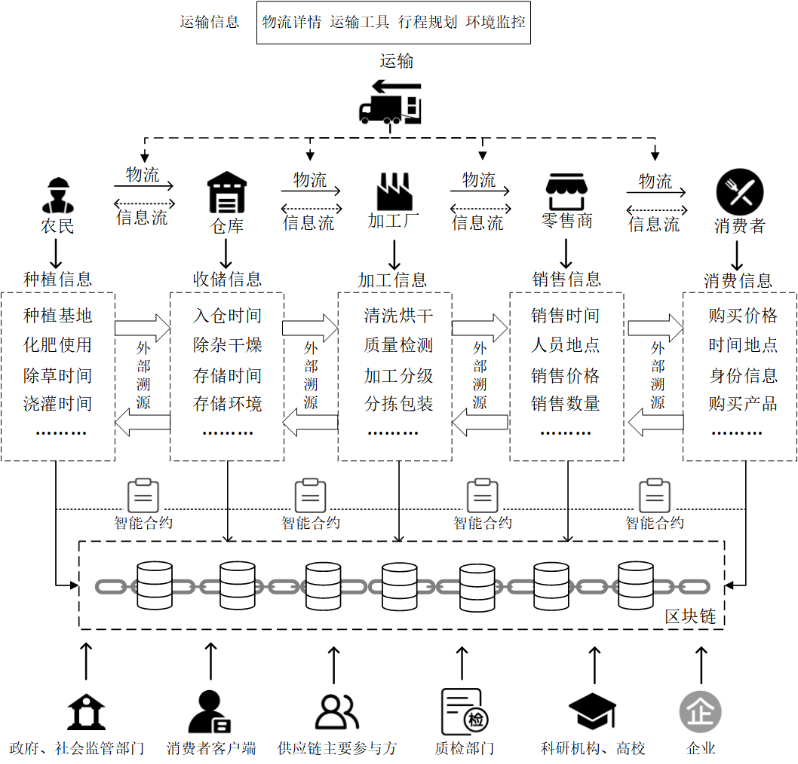

# 可信农产品供应链的区块链构建路径研究

**摘  要**：构建安全、透明、高效的现代化农产品供应链是推进我国农业高质量发展的核心议题。针对传统供应链因中心化特性导致的信任缺失、信息不透明及协作效率低下等严峻挑战，主要探讨了区块链技术的赋能路径与核心机理。首先剖析了传统供应链的信任瓶颈，并深入阐述了区块链通过分布式账本、共识机制与智能合约等核心技术重构信任基础的内在逻辑。在此基础上，重点分析了构建可信供应链的技术框架与应用模型，探讨了区块链与物联网、分布式存储等新一代信息技术融合，在保障源头数据可信、实现系统可扩展以及满足安全合规需求方面的重要作用。进一步地，系统梳理了该技术路径在实践中面临的性能瓶颈、数据隐私、标准统一及应用成本等共性挑战，并对未来技术融合的深化与应用生态的完善趋势进行了展望。

**关键词**：区块链；农产品供应链；信任体系；农产品溯源；数据安全；智慧农业

**中图分类号**：s-01   **文献类型标识码**：A 

---

## 前言

随着我国经济社会步入高质量发展阶段，消费者对农产品质量安全的要求日益提高，建立一套覆盖全产业链、信息透明、责任明确的追溯体系已成为农业现代化的迫切需求。然而，我国农产品供应链普遍存在链条长、环节多、参与主体分散等特点。传统的供应链信息管理严重依赖各环节核心企业的中心化系统，导致了严重的信息孤岛与数据壁垒，上下游之间缺乏有效的信任传递机制。一旦发生质量安全事件，往往难以快速、精准地定位问题源头和责任主体，严重影响了产业信誉和消费者信心。

近年来，不断曝光的食品安全问题已成为事关民生的重大社会问题，亟需从法律和制度层面加强规制与保障[1]。为此，我国政府高度重视产品追溯体系的建设与实践，并将其视为保障消费安全和公共安全的重要手段[2]。我国的农产品质量安全可追溯体系建设经历了从制度框架构建到平台化推广，再到当前数字化、智能化转型的多个阶段，技术与模式在不断演进[3]。然而，传统中心化追溯系统固有的信息孤岛与信任难题依然是制约其效能发挥的核心瓶颈。因此，如何运用先进信息技术打破信任壁垒，构建协同高效的现代化农业供应链，已成为当前农业科技领域亟待解决的重大课题。

区块链技术作为一种颠覆性的分布式信任技术，为此提供了创新的解决方案。自中本聪提出一种纯粹的点对点电子现金系统以来[4]，其底层技术通过密码学、共识机制和分布式存储等技术的集成，构建了一个多方参与、共同维护、数据不可篡改的共享账本。近年来，国内外学者围绕区块链在农产品溯源领域的应用展开了积极探索。部分研究聚焦于构建基于区块链与物联网的溯源系统，以提升数据的真实性；亦有研究者关注区块链的存储性能局限，提出了“链上+链下”协同存储的优化方案。这些研究成果验证了区块链技术在农业领域应用的巨大潜力。然而，现有研究多偏向于具体的技术实现或案例分析，而对于区块链如何系统性赋能、构建可信农产品供应链的宏观路径、关键技术融合模式以及共性挑战的系统化理论构建或综合性综述仍有待加强。许多研究在探讨如何构建系统与如何实现有效追溯方面仍面临信息安全与信任传递等核心难题[5]。本文旨在对这一议题进行深入探讨，不仅梳理其技术构建路径，更从信任重构的内在机理出发，分析核心技术要素与融合架构，并系统性地审视其在实践中面临的挑战与未来发展趋势，以期为我国智慧农业建设和相关产业政策的制定提供更为全面和深入的理论参考。

## 1 区块链和相关技术

### 1.1 区块链技术
区块链技术结合了公钥密码学、P2P(peer-to-peer，点对点)网络、分布式账本、工作量证明和智能合约等技术，保证了信息的真实性和系统的可行度。该技术分为数据层、网络层、激励层、合约层和应用层五个层次，每个层次都有其特定的功能和作用，共同构建起一个去中心化的信任体系。在这一体系中，区块链技术基于几个核心组件，包括哈希函数、P2P网络、Pow共识算法和UTXO模型等。哈希函数确保数据的完整性和不可篡改性，P2P网络允许网络中的节点直接通信，无需中心化管理。Pow共识算法通过解决计算难题来达成网络共识，确保网络安全。UTXO模型则保证了交易的原子性和不可分割性。这些核心组件共同构成了区块链系统的基础。作为典型的分布式系统，区块链的性能和安全性高度依赖其底层的P2P网络。该网络在安全模型、拓扑结构和传输协议等方面与传统P2P网络存在显著差异，其运行效率直接影响着整个系统的可扩展性与交易确认速度[6,7]。

随着发展历程的演进，区块链经历了比特币1.0、可编程2.0和智能合约3.0阶段。在比特币1.0阶段，数字货币成为代表；而在可编程2.0阶段，智能合约的引入实现了更为复杂的去中心化应用。智能合约3.0阶段将区块链技术与物联网、大数据等技术融合，推动了更广泛的应用。根据应用需求，可选择不同类型的区块链，如公链、联盟链和私有链。联盟链平台如Hyperledger Fabric、FISCO BCOS和ChainMaker等，为企业级应用提供了有力支持，它们在架构设计、共识机制和应用场景上各有侧重。在行业应用方面，区块链在金融、政务、溯源等领域展现出广泛的应用前景。

### 1.2 物联网技术
物联网是指通过各种信息传感器、射频识别技术、全球定位系统、红外感应器等各种装置与技术，实时采集任何需要监控、连接、互动的物体或过程，采集其声、光、热、电、力学、化学、生物、位置等各种需要的信息，通过各类可能的网络接入，实现物与物、物与人的泛在连接，实现对物品和过程的智能化感知、识别和管理的技术。在农业领域，物联网的应用可以实现对农作物生长环境、仓储条件、冷链运输过程的实时、精准监控。将物联网技术与区块链相结合，通过确保源头数据的真实可靠，是解决数据可信问题的关键路径。

### 1.3 分布式存储与IPFS
尽管区块链具有不可篡改的优点，但其链式结构和全节点存储的特性决定了它不适合直接存储大规模数据，尤其是图片、视频等非结构化文件，否则会导致“账本膨胀”，严重影响系统性能。分布式存储技术为此提供了解决方案。其中，星际文件系统（InterPlanetary File System, IPFS）是一种典型的点对点分布式文件系统，它通过内容寻址而非传统的域名寻址来定位文件。每个存入IPFS的文件都会根据其内容生成一个唯一的哈希值作为其地址。这种机制不仅能有效去重、节省存储空间，还具有天然的防篡改特性，因为文件内容的任何微小变动都会导致其地址的改变。在农业食品供应链中应用该技术，将关键数据摘要上链，而将图片、视频等原始大文件存入IPFS，已成为一种应对区块链存储瓶颈的高效解决方案。这种“链上链下-双存储”的模式，既保证了核心数据的不可篡改与可追溯，又避免了链上数据冗余，在政府数据共享、数字档案管理等多个领域也得到了广泛应用与验证[8,9]。

## 2 区块链重构农业供应链信任的内在机理

### 2.1 分布式账本与数据共享
区块链技术的核心是一个分布式共享账本，网络中的所有合法参与方都拥有一份完整且实时同步的账本副本。任何信息的记录，都需要在网络中进行广播，并由参与各方共同见证。这种“多方持有、共同维护”的模式，从根本上打破了传统供应链中由于信息被单一实体控制而形成的“信息孤岛”，实现了跨主体的可信数据共享，为供应链的全面透明化管理奠定了基础[10]。相比于传统各自独立的ERP系统，分布式账本创造了一个所有利益相关方都能访问的“单一事实来源”，极大地降低了信息核对与协调的成本。

### 2.2 共识机制与数据不可篡改
数据写入区块链需要经过网络节点的共识过程。共识机制是一套确保账本一致性的算法和规则，例如工作量证明或在联盟链中更常用的实用拜占庭容错等。一笔交易只有在得到网络中足够数量节点的验证和确认后，才能被打包进新的区块。一旦数据被写入区块，并通过哈希指针与前一个区块链接起来，就形成了一个在时间上有序、在密码学上安全的链式结构。任何对历史数据的微小改动都会导致链式结构被破坏，从而被整个网络轻易地发现和拒绝。这种特性保证了上链数据的永久性、完整性和不可篡改性，为农产品“从农场到餐桌”的每一个环节提供了坚实的数据信任根基。正是这种由技术强制执行的不变性、透明度和可审计性，重塑了供应链主体间的信任传递与融合机制，为构建下一代价值互联网奠定了基础。

### 2.3 智能合约与流程自动化
智能合约是部署在区块链上的一段自执行代码，它将供应链各方之间的协议、业务规则和监管要求以程序化形式进行编码。当满足预设的触发条件时，智能合约会自动执行相应的操作。通过智能合约，可以将传统依赖人工执行和监督的流程自动化、透明化、强制化，极大地减少了人为操作失误、道德风险和履约纠纷，显著提升了供应链的协同效率和流程的可信度。例如，一份采购合同可以被编写成智能合约，当物流信息显示货物已签收且质检信息显示合格时，合约自动将货款从买方账户划转至卖方账户，实现了“货到付款”的自动可信执行。

## 3 可信供应链构建的核心技术路径

构建基于区块链的可信农产品供应链，并非单一技术的简单应用，而是一个涉及多技术融合、多层次协同的系统工程。其核心在于构建一个从数据源头到最终消费、从业务逻辑到技术支撑的全方位可信模型。见图1所示，一个典型的基于区块链的农产品供应链溯源模型，清晰地描绘了信息流与实体物流在各个环节的并行与交互。从农民的种植信息，到仓库的收储信息，再到加工厂的加工信息，以及零售商的销售信息，每一个环节产生的关键数据，都在相应责任主体的参与下，通过预设的智能合约规则进行验证，并有序地记录到区块链上。政府、社会监管部门、消费者等相关方则可以通过各自的客户端或接口，对链上数据进行查询与监管，从而形成一个透明、多方共治、全程可追溯的生态系统。这种模型将原本线性的、不透明的供应链，转变为一个网状的、基于共识的可信价值网络。

国内外已有诸多研究基于类似理念，构建了针对粮油食品、特定农产品的全供应链信息追溯模型。张新[11]等人融合可信区块链与可信标识技术，为粮油食品构建了全供应链信息追溯模型，旨在解决传统追溯系统中数据安全性低和共享性差的问题。针对高价值农产品的性能需求，徐伟[12]等人在食用菌的溯源研究中，设计了一种主侧链协同的多链追溯架构，通过“链上链下”混合管理策略有效缓解了单一区块链的存储开销与响应效率瓶颈。此外，部分研究也探索了模式创新，如Malavathula N等人[13]开发了集成溯源与直销功能的去中心化平台，旨在消除中间环节以增加农民收入；而李佳欣[14]等人则提出了融入政府可信化监管的模型，通过“区块链+PBFT机制”来加强市场监督与消费者权益保护。

<b>图1 农产品供应链溯源应用模型</b>

### 3.1 物联网与源头数据可信化
区块链能够保证上链数据不被篡改，但无法保证数据上链前的真实性。为解决“垃圾数据上链”的风险，必须将区块链与物联网技术深度融合。通过为农田、仓库、冷链车等关键物理场景部署带有唯一身份标识的传感器、RFID标签、摄像头等物联网设备，可以实现对环境参数、地理位置、操作行为等溯源信息的自动化、实时化、客观化采集。这些由机器直接产生的数据，经签名后直接上链，最大限度地减少了人为干预和数据造假的可能性，从而构筑了可信供应链的第一道防线——源头数据可信。这种融合不仅提升了数据的可信度，也极大地丰富了溯源信息的维度，是实现农产品智慧供应链，推动生产环节精准决策与管理的关键路径[15]。通过高质量的源头数据，为后续的精细化管理和大数据分析提供了坚实基础。

### 3.2 融合架构与系统可扩展性
为支撑复杂的商业应用，区块链底层需要一个稳定、高效、可扩展的技术架构。见图2所示的联盟链架构（Hyperledger Fabric），是一种非常适合企业级供应链应用的模式。它允许多个经过许可的组织共同参与网络，形成一个多中心化的治理结构。每个组织拥有自己的对等节点，负责存储账本、运行智能合约。客户端应用程序或企业内部系统通过SDK或API与网络交互，将业务操作转化为链上交易。交易经各方按预设策略背书后，由独立的排序服务进行全局排序并打包成区块，最终分发给所有相关节点。这种架构在保证去中心化协作的同时，通过许可准入和通道隔离机制，提供了良好的性能、隐私保护和权限控制能力。

<b>图2 联盟链网络技术架构示意图</b>

同时，为应对溯源过程中海量图片、视频等非结构化数据带来的存储压力，需采用“链上链下”协同的融合存储架构。即将关键的、结构化的数据摘要记录在区块链上，以确保其不可篡改和可追溯；而将原始的大文件存储在IPFS等分布式存储系统中，通过链上记录的地址索引进行关联。此外，为满足国家对关键信息基础设施的安全合规要求，区块链平台应在密码服务层集成国密算法，实现从身份认证到数据加密的全流程自主可控，为农业核心数据安全提供坚实保障。在Hyperledger Fabric的国密化改造方面，已有研究不仅成功将国密算法嵌入平台底层，并系统性地验证了其可行性与性能[16]，还在此基础上进一步探索了上层应用，如设计并实现了基于国密算法的交易数据隐私保护与安全共享方案[17]，为区块链在国内的合规落地提供了从底层支持到上层应用的关键技术路径。

## 4 挑战与展望

### 4.1 面临的主要挑战
尽管技术路径日益清晰，但区块链在农业供应链的规模化应用仍面临诸多挑战。首先是性能与成本的平衡，区块链的共识过程会带来一定的交易延迟和计算开销，建设和维护成本相对较高，对于利润微薄的农业领域，需要探索更轻量级、低成本的解决方案。其次是数据隐私保护，链上数据的透明性是一把双刃剑，可能泄露企业的商业秘密和个人隐私，如何在保障可追溯性的同时实现数据的选择性共享和隐私保护，是必须解决的关键科学问题。再次是标准化与互操作性，目前缺乏统一的农业数据上链标准、接口规范和跨链技术协议，易形成新的“区块链孤岛”，这在我国追溯体系的建设历程中也是长期存在的问题。

### 4.2 未来发展趋势
展望未来，区块链技术在农业供应链领域的应用将朝着更加智能化、生态化和普惠化的方向发展。
第一，与人工智能的深度融合。基于区块链提供的海量、可信、时序化的供应链数据，人工智能模型可以进行更精准的产量预测、病虫害预警、市场需求分析和智能物流调度，实现从“可信溯源”到“智能决策”的跨越。
第二，跨链技术与数据要素化。随着跨链技术的成熟，不同区域、不同品类的农业区块链将实现互联互通，形成统一的农业数据大市场。数据作为核心生产要素，其价值可以在可信环境中被安全地确权、流转和交易。
第三，与供应链金融的协同创新。基于链上可信的交易记录和资产凭证，金融机构可以为中小农业企业提供更便捷、低成本的融资服务，有效解决农业领域的“融资难、融资贵”问题，形成产业与金融的良性互动。要推动这一生态的形成，还需考虑供应链成员的参与意愿和投入决策。从演化博弈的角度看，设计合理的政府补贴与市场激励机制，能够有效克服企业在技术投入中可能存在的“搭便车”问题，促使供应链各主体积极采纳区块链技术，从而实现整体效益的最大化[17]。

## 5 总结

区块链技术以其构建机器信任的独特能力，为破解我国农产品供应链长期存在的信息不对称和信任缺失等难题提供了根本性的解决方案。通过系统性地构建融合物联网、分布式存储等技术的综合应用模型，并建立在安全合规的技术架构之上，区块链能够为我国农业现代化建设打造一个透明、协同、高效、可信的数字底座。尽管在性能、隐私、成本和标准化等方面仍面临挑战，但随着技术的持续演进和应用生态的不断完善，区块链必将在保障国家粮食安全、提升农产品附加值、促进农业产业数字化转型和助力乡村振兴战略中发挥越来越重要的作用。

---

## 参考文献

[1] 王新庄. 食品安全问题探讨及法律规制研究——评《食品安全法原理》[J].食品安全质量检测学报,2022,13(17):5769.
[2] 赵阳,孟慧敏. 我国重要产品追溯体系建设实践和对策建议[J].轻工标准与质量,2024,(05):131-134.
[3] 孙传恒, 朱文颖, 邢斌, 等. 中国农产品质量安全可追溯体系发展历程与展望[J]. Transactions of the Chinese Society of Agricultural Engineering, 2025, 41(12).
[4] Nakamoto S. Bitcoin: A peer-to-peer electronic cash system[EB/OL].(2008) [2025-11-01]. https://bitcoin.org/bitcoin.pdf.
[5] 胡祥培,都牧,孔祥维,等.基于区块链的农产品供应链溯源研究综述[J].管理科学学报,2024,27(05):1-12.
[6] 司冰茹,肖江,刘存扬,等. 区块链网络综述[J].软件学报,2024,35(02):773-799.
[7] 倪雪莉,马卓,王群. 区块链P2P网络及安全研究[J].计算机工程与应用,2024,60(05):17-29.
[8] 唐豪, 易文龙, 赵应丁, 等. 基于区块链的农产品可信检测数据存储方法[J]. 科学技术与工程, 2022, 22(24).
[9] 周颖玉,王海英,柯平,等.基于区块链的开放政府数据“链上链下-双存储”共享模型研究[J].情报杂志,2023,42(09):188-195.
[10] Hai J,Jiang X.Towards trustworthy blockchain systems in the era of “Internet of value”: development, challenges, and future trends[J].Science China Information Sciences,2022,65(5):151101.
[11] 张新, 彭祥贞, 李悦, 等. 基于可信区块链和可信标识的粮油食品全供应链信息追溯模型[J]. 农业大数据学报, 2022, 4(1): 35-48.
[12] Xu W ,Guo H ,Zhang X , et al.Research on a Blockchain-Based Quality and Safety Traceability System for Hymenopellis raphanipes[J].Sustainability,2025,17(16):7413-7413.
[13] Malavathula N, Shaik S, Nayanagar S C R, et al. Decentralized traceability and direct marketing of agricultural supply chain[C]//AIP Conference Proceedings. AIP Publishing LLC, 2025, 3237(1): 030037.
[14] 李佳欣,谭凯畅,施海东,等.区块链架构下农产品溯源政府可信化监督管理优化模型[J].食品安全导刊,2024,(09):23-26+32.
[15] 韩佳伟,杨信廷.农产品智慧供应链：内涵、关键技术与未来方向[J].智慧农业(中英文),2025,7(03):1-16.
[16] 曹琪,阮树骅,陈兴蜀,等. Hyperledger Fabric平台的国密算法嵌入研究[J].网络与信息安全学报,2021,7(01):65-75.
[17] 王晶宇,马兆丰,徐单恒,段鹏飞. 支持国密算法的区块链交易数据隐私保护方案[J].信息网络安全,2023,23(03):84-95.
[18] 霍红,钟海岩. 农产品供应链质量安全中区块链技术投入的演化分析[J].运筹与管理,2023,32(01):15-21.